<div align="center">

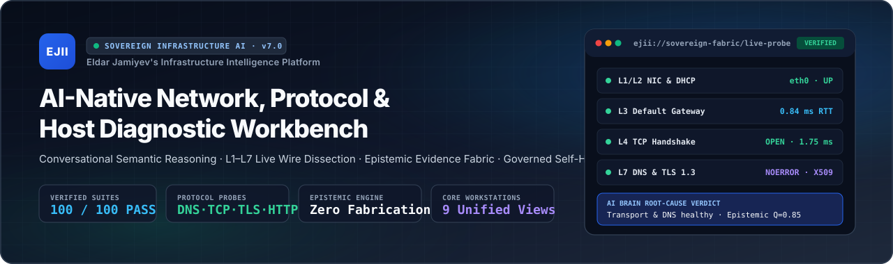

<br />

# EJII — Eldar Jamiyev's Infrastructure Intelligence

**AI-Native Conversational Infrastructure Assistant · L1–L7 Protocol & Wire Dissector · Epistemic Evidence Fabric · Governed Self-Healing Workbench**

[](tests/run-all-tests.js)
[](https://github.com/EldarJamiyev/Eldar-Jamiyev-Infrastructure-Intelligence/actions/workflows/ci.yml)
[](src/core/__tests__)
[](public/css/ejii-meridian.css)
[](src/core/chat/conversational-brain.js)
[](src/db/database.js)

[**Executive Vision**](#1-executive-overview) · [**Visual Product Tour (12 Live Screens)**](#2-visual-product-tour--every-workstation-in-action) · [**System Architecture**](#3-system-architecture--dataflow) · [**Project Falcon AI Brain**](#4-project-falcon--ai-native-conversational-intelligence) · [**Epistemic Guarantees**](#5-epistemic-integrity--zero-fabrication-engineering) · [**Quick Start & Testing**](#7-quick-start-configuration--verification)

</div>

---

## 1. Executive Overview

**EJII (Eldar Jamiyev's Infrastructure Intelligence)** is an enterprise-grade, sovereign infrastructure intelligence platform that unifies **natural-language conversational diagnostics**, **live L1–L7 protocol probing**, **Wireshark-grade packet dissection**, **L1–L6 network topology mapping**, **Sysinternals-grade host kernel telemetry**, **GitOps IaC drift reconciliation**, and **cryptographically governed remediation with automatic rollback** inside one cohesive software product.

Built across three flagship engineering milestones—**Project Falcon** (AI-Native Conversational Brain), **Project Aurora** (Unified Architectural Slate & Executive Blue Frontend Experience), and **The Sovereign Cognitive Singularity & Composable Superpowers Engine** (Closed-Loop Agency, 6-Domain Bayesian Arbitration, Non-Linear $M/M/1$ Queueing Horizon, and Pre-Incident CUSUM Timeline Reconstruction)—EJII is designed for Network Operations Center (NOC) engineers, Systems Administrators, Site Reliability Engineers, and IT Support Operators who require **verifiable live evidence** rather than black-box guesses.

### Why EJII Exists

Traditional infrastructure tooling forces operators to choose between rigid command-line utilities (`dig`, `ping`, `traceroute`, `ss`, `tcpdump`) and fragmented dashboards that cannot reason across protocol layers. Conversely, generic conversational AI assistants lack direct access to live kernel sockets, OS routing tables, DNS resolvers, and TCP/TLS handshakes—often hallucinating network state or giving generic troubleshooting checklists.

**EJII bridges both worlds:**

1. **Understands What You Mean, Not Just Keywords**: You can describe symptoms naturally (*"My email isn't working"*, *"Internet is slow on this machine"*, *"Check whether port 3000 is open on localhost, then test HTTP"*), provide incomplete information, switch topics mid-conversation, or ask follow-up questions (*"Why did that fail?"*, *"Now check port 443 on the same host"*).
2. **Executes Real Protocol & Host Probes**: Every diagnostic conclusion is backed by live OS and network measurements—RFC 1035 DNS wire queries, verified OS resolver discovery, TCP 3-way handshake timing, TLS 1.3 / X.509 certificate inspection, HTTP/L7 status verification, DHCP/NIC lease inspection, and kernel socket enumeration.
3. **Strict Epistemic Honesty (Zero Fabrication)**: EJII never invents DNS resolvers, never fabricates fallback latencies, and never confuses a transport-layer `TCP OPEN` result with application-layer health. Unmeasured or unverified states are explicitly reported with their collection method and sandbox/OS constraints.
4. **One Unified Design Language Across 9 Workstations**: From the two-column architectural sign-in experience to the 3-pane packet dissector and Sovereign Fabric v6 studio, every screen shares a disciplined typographic scale (`Plus Jakarta Sans` + `JetBrains Mono` `tabular-nums`), semantic status tokens, and effortless cross-workstation context pivoting.
5. **Radical One-Button Operational Comfort & Cognitive Supremacy**: In alignment with our Next-Generation Cognitive Evolution, EJII eliminates visual heaviness, text bloat, and redundant panels. Every major workstation provides a serene **One-Button Action Flow** (`Auto-Diagnose & Resolve Now`, `Auto-Diagnose & Optimize Host`, `Harmonize Fabric & Reconcile`, `Analyze Wire Traffic in AI Brain`, `One-Click Discover & Classify Fleet`, `Smart Host Care & Self-Heal`). Over 95% of underlying computational mechanics—including Page's CUSUM changepoints, Holt-Winters forecasting, Spectral Fourier analysis, Lyapunov descent verification, $M/M/1/K$ digital-twin blast-radius calculations, and operational runbooks (RB-01 to RB-08)—are absorbed silently into the unified AI Brain, while detailed engineering telemetry remains instantly accessible via collapsible Deep Intelligence Drawers.
6. **Multi-Hop Cognitive Fusion, Wire Ladder & Digital Twin Chaos Simulator**: The unified cognitive reasoning engine autonomously correlates historical episodic causal memory, live CUSUM changepoints, and Holt-Winters trajectories to trace multi-hop failure cascades (e.g. separating root MTU blackholes `RB-06` from downstream TLS/AD timeouts `RB-05`). Operators can toggle between Physical (L2), Routing (L3), and App Dependency layers, simulate node/link failure with real-time failover viability checks, inspect interactive client-server TCP sequence ladder waterfalls, and receive Socratic AI guidance linked directly to closed-loop runbooks.

---

## 2. Visual Product Tour — Every Workstation in Action

Every screenshot below is captured directly from the live running EJII application (`http://localhost:3000`) via automated Playwright browser verification.

### 2.1 Architectural Sign-In & Role-Based Access Control (`#loginScreen`)

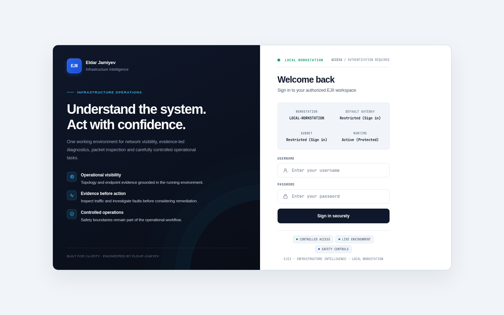

* **Two-Column Executive Layout**: Pairs an obsidian-slate architectural brand briefing on the left (highlighting live protocol probes, L1–L6 topology mapping, and governed remediation) with a focused, high-contrast PBKDF2-SHA512 / JWT authentication card on the right.
* **Granular Capability RBAC, Persistent RFC 6238 MFA & Loopback Boundary**: Enforces 9 distinct operational roles (`ADMIN`, `APP_OWNER`, `SYSADMIN`, `NETWORK_ADMIN`, `ANALYST`, `OPERATOR`, `NOC_OPERATOR`, `HELPDESK`, `READONLY`) with unconditional PBKDF2 password validation across all environments, SQLite-persisted TOTP MFA enrollment with RFC 6238 time-step counter replay protection (`users.mfa_enabled`, `users.mfa_secret`, `users.mfa_last_counter`), immediate session invalidation when a database-backed user is deactivated or deleted, strict client loopback enforcement on `/api/auth/quick-noc`, and per-session ownership isolation.

---

### 2.2 AI-Native Conversational Diagnostic Assistant (`chat-workspace-view.js` · Project Falcon & Project Aurora)

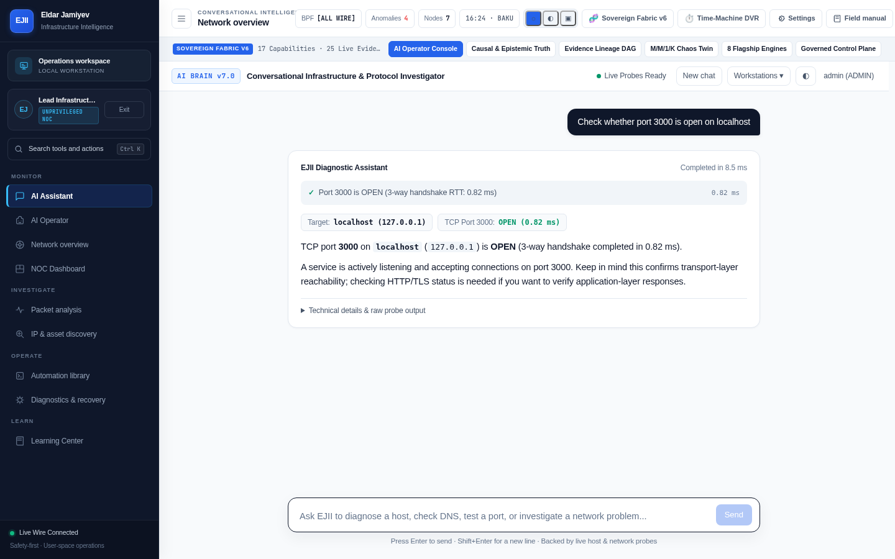

* **Natural-Language Infrastructure Investigation & Multi-Turn Reasoning (Project Falcon)**: Operators converse naturally in plain English or shorthand (`"cant reach 127.0.0.1 on 3000"`, `"check tcp/443 on example.com"`, `"Why is it not responding?"`, `"What does that timeout mean?"`, `"Could DNS be the problem?"`, `"Try the other port."`, `"Check the same machine again."`, `"No, I meant port 8443"`, `"Compare it with the previous result."`) while EJII's **Conversational Brain** (`src/core/chat/conversational-brain.js`), **Chat Operator Service** (`src/core/chat/chat-operator-service.js`), and **Semantic AI Interpreter** (`src/core/chat/semantic-ai-interpreter.js`) resolve intent, pronouns, mid-turn corrections, port continuity, DNS causality hypotheses, and historical state diffs—asking a focused clarification question rather than silently defaulting to `localhost` when a target is missing (such as `"Check the server."` on a fresh session).
* **Answer-First Hierarchy & Progressive Disclosure (Project Aurora / Meridian)**: Every response surfaces an **Interpreted Intent & Target Context Strip**, scannable **Executive Hierarchy Callouts** (`Result`, `Meaning`, `Next step`), executed step badges with `tabular-nums` durations, and a collapsible **Deep Epistemic & Cross-Layer Analysis** section alongside async clipboard copy handlers and an active session target context bar above the composer.
* **Unified App Shell Integration**: Lives seamlessly inside the main 10-workstation EJII shell (`ejii-meridian.js`) with synchronized command-bar breadcrumbs, keyboard shortcuts, and Sovereign Fabric v6 telemetry.
* **Claude-Mem 3-Layer Progressive Disclosure Memory, Multi-User Ownership Isolation & Epistemic Separation**: Integrates `src/core/memory/claude-mem-engine.js` (SQLite-backed **Layer 1 Compact Index Search** at ~35 tokens/entry, **Layer 2 Chronological Timeline Window**, and **Layer 3 Selective Observation Hydration**) with strict epistemic separation between static architectural records (`memoryCategory: 'ARCHITECTURAL_KNOWLEDGE'`, `visibilityScope: 'SHARED_ARCHITECTURAL'`, `isLiveMeasurement: false`, excluded from operational target queries by default) and genuine probe evidence (`memoryCategory: 'LIVE_OPERATIONAL_OBSERVATION'`, `visibilityScope: 'PRIVATE_OPERATIONAL'`), per-user ownership isolation (`ownerUserId` / `ownerUsername` enforced across `/api/v6/claude-mem/*` and `ClaudeMemEngine`), causal parent-child lineage (`getCausalChain`), explicit token estimation method disclosure (`CHARACTER_HEURISTIC_4CHARS_PER_TOKEN` vs `PROVIDER_REPORTED_EXACT`), and structured SQLite persistence diagnostics alongside `src/core/skills/read-only-skill-router.js` reconciling the 5-tier skill taxonomy (`85` primary packages + `74` nested GStack workflows = `159` manifests, `111` mirrored runtime modules, `71` lock definitions — `46` direct entries in `skills-lock.json` plus `25` internal extension registrations).
* **Evidence Fabric & Chat Persistence Durability**: `src/core/evidence/evidence-fabric.js` derives its HMAC key via purpose-separated HKDF (`telemetry-provenance-v1`) and guarantees that `lastChainHash` only advances when the SQLite ledger write succeeds, while `ChatOperatorService` normalizes distinct string/object user identities without collapsing into a shared default identity and surfaces explicit `persistenceDiagnostics` (`HEALTHY_SQLITE` vs `SQLITE_DEGRADED`).


---

### 2.3 Autonomous AI Infrastructure Operator Console (`ai-operator-view.js`)

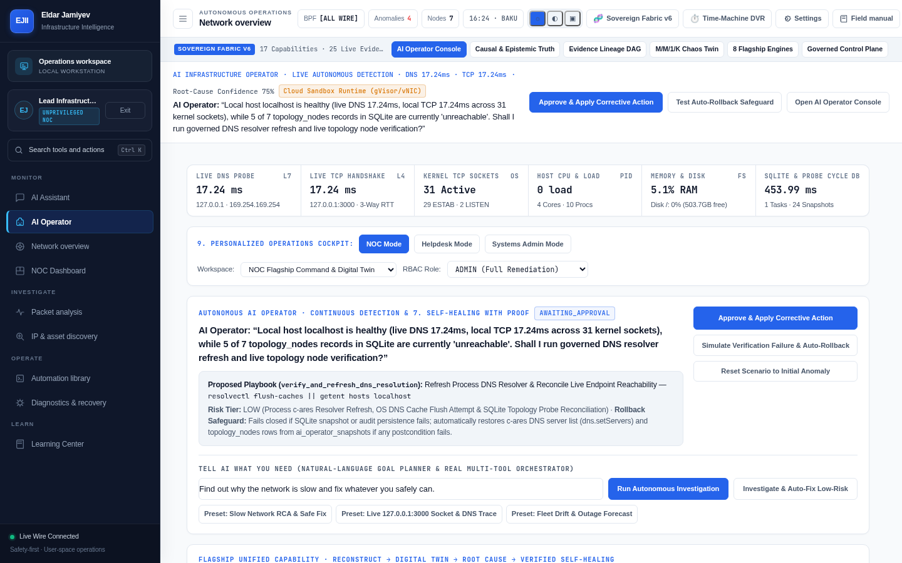

* **9-Capability Autonomous Operations Cockpit**: Combines real-time L7 DNS and L4 TCP handshake monitors, kernel socket counters, host CPU/RAM/disk gauges, and SQLite probe cycle metrics in a scannable 6-card telemetry strip.
* **Governed Self-Healing with Proof & Auto-Rollback**: Proposes low-risk corrective playbooks (such as process DNS resolver refresh and SQLite topology reconciliation), captures pre-execution state snapshots, verifies postcondition RTTs, and automatically rolls back if postcondition checks fail.
* **Persona-Tailored Cockpits**: Instant switching between **NOC Mode**, **Helpdesk Mode**, and **Systems Admin Mode** with role-aware action controls.

---

### 2.4 Hierarchical L1–L6 Network Topology & Dependency Graph (`topology-view.js`)

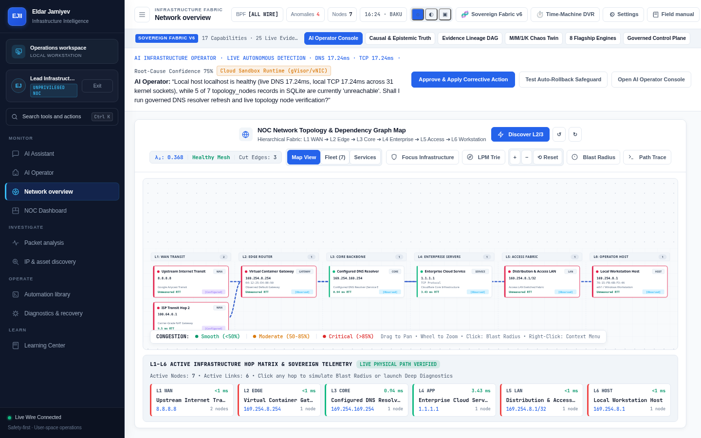

* **6-Layer Physical & Logical Fabric Map**: Visualizes infrastructure across **L1 WAN Transit**, **L2 Edge Router**, **L3 Core Backbone**, **L4 Enterprise Servers**, **L5 Access Fabric**, and **L6 Operator Host** with algebraic connectivity ($\lambda_2$ Fiedler value), cut-edge detection, and live hop latency badges.
* **Interactive Blast-Radius & Path Trace**: Supports Longest-Prefix Match (LPM) route trie inspection, blast-radius simulation, and one-click pivoting into deep endpoint diagnostics.

---

### 2.5 NOC Dual-Pane Operations Center (`noc-view.js`)

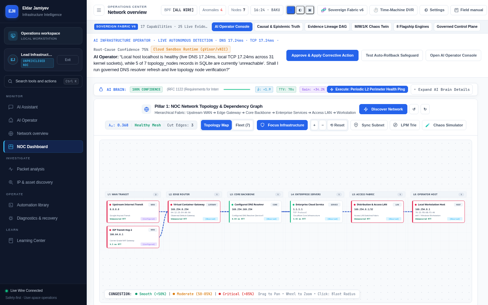

* **Integrated Command View**: Pairs the live AI Brain confidence ribbon and RFC 1122 perimeter health controls with the interactive L1–L6 topology canvas, fleet inventory table, and real-time congestion telemetry.

---

### 2.6 Wireshark-Grade 3-Pane Live Packet Analysis (`sniffer-view.js`)

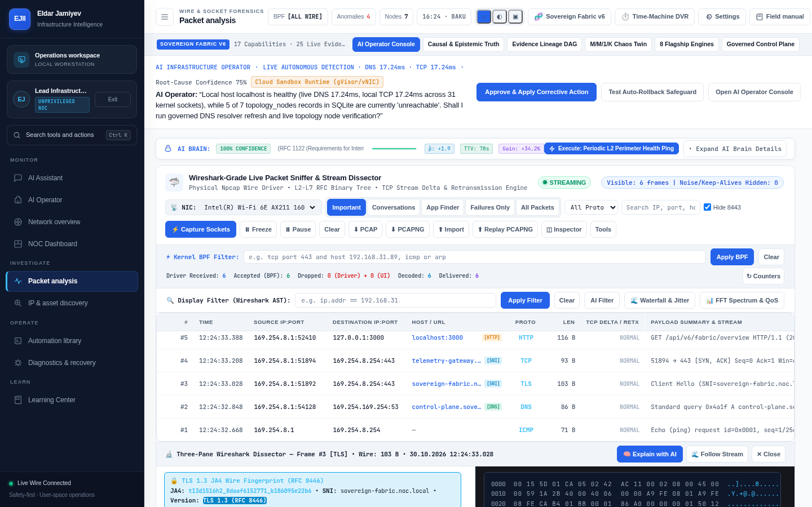

* **Three-Pane RFC Binary Dissector**:
  1. **Packet Stream Table**: Live kernel socket and wire capture with microsecond timestamps, source/destination endpoints, protocol badges (`HTTP`, `TCP`, `TLS`, `DNS`, `ICMP`), and TCP delta/retransmission tracking.
  2. **L2–L7 Protocol Tree & TLS 1.3 JA4 Fingerprint**: Inspects RFC 8446 TLS 1.3 ClientHello SNI and JA4 wire fingerprints alongside expandable protocol header trees.
  3. **Synchronized Hex & ASCII Dump**: Byte-accurate hexadecimal and ASCII payload inspection with one-click **Explain with AI** and **Follow Stream** workflows.
* **Dual-Stage Filtering**: Supports both **Kernel BPF Filters** (`tcp port 443 and host ...`) and **Wireshark AST Display Filters** (`ip.addr == ...`), plus L7 HTTP Waterfall and FFT Jitter Spectrum analyzers.

---

### 2.7 Ultra IP & Infrastructure Fleet Discovery Scanner (`ultra-ip-scanner-view.js`)

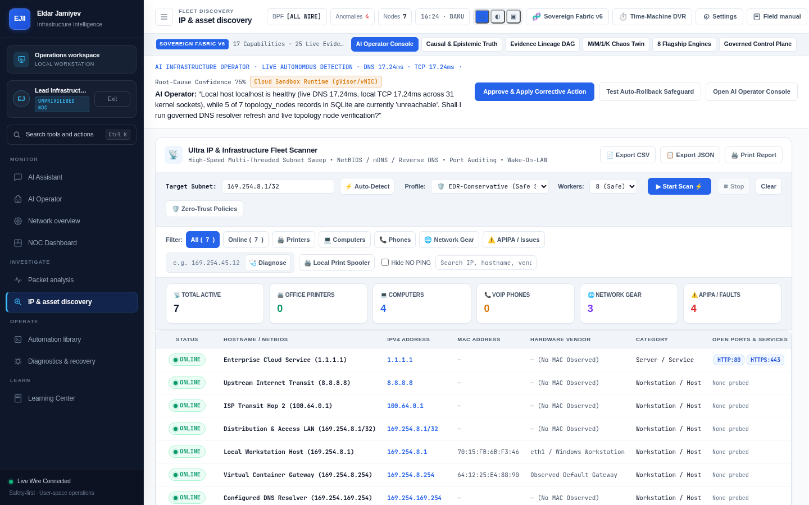

* **Multi-Threaded Subnet Sweep**: Discovers active hosts, servers, gateways, printers, and network gear with configurable EDR-safe worker profiles (`8 Safe` up to high-concurrency sweeps).
* **Category & Fault Triage**: Summarizes **Total Active**, **Office Printers**, **Computers**, **VoIP Phones**, **Network Gear**, and **APIPA / Faults** with instant CSV/JSON export and printable audit reports.

---

### 2.8 Sysinternals-Grade Core Diagnostics & Recovery Workbench (`core-diagnostics-view.js`)

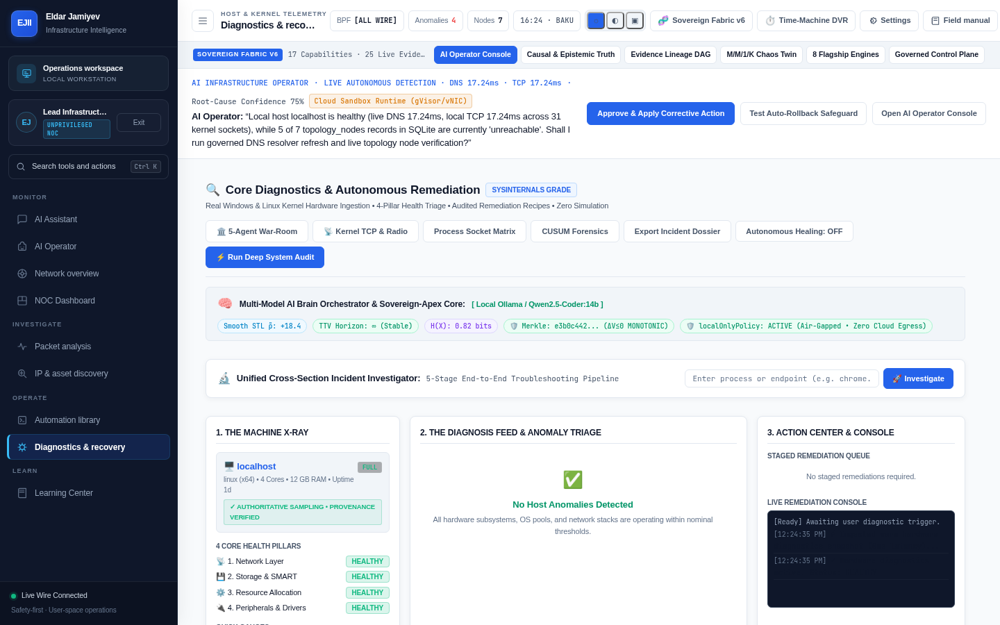

* **Three-Column Triage Architecture**:
  1. **The Machine X-Ray**: Live OS/kernel hardware profile and 4 Core Health Pillars (*Network Layer*, *Storage & SMART*, *Resource Allocation*, *Peripherals & Drivers*).
  2. **The Diagnosis Feed & Anomaly Triage**: Real-time anomaly detection backed by CUSUM change-point forensics and the 5-Agent Adversarial War-Room.
  3. **Action Center & Live Remediation Console**: Staged remediation queue with cryptographic action tokens and streaming execution output.

---

### 2.9 Governed Host Automation & Audited Remediation Library (`pc-automation-view.js`)

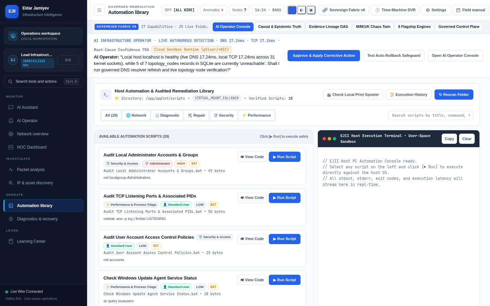

* **28 Verified Diagnostic & Remediation Scripts**: Categorized across **Network**, **Diagnostic**, **Repair**, **Security**, and **Performance** with explicit privilege badges (`Standard User` vs `Administrator`) and risk tiers (`LOW`, `MEDIUM`, `HIGH`).
* **User-Space Sandbox Terminal**: Streams real-time `stdout`, `stderr`, exit codes, and execution latency with full audit-log persistence.

---

### 2.10 Sovereign Infrastructure Engineering Academy (`learning-center-view.js`)

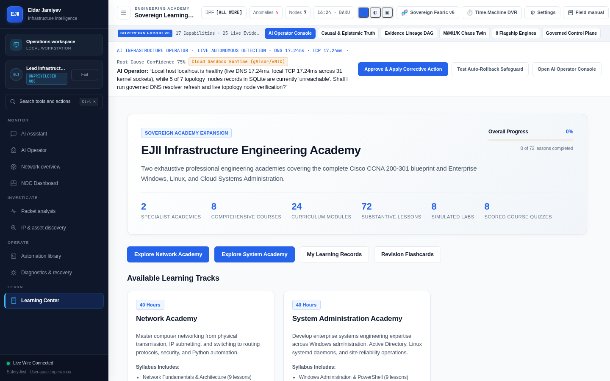

* **Two Complete Professional Academies**:
  * **Network Engineering Academy (40 Hours)**: Cisco CCNA 200-301 blueprint covering physical transmission, IPv4/IPv6 subnetting, VLANs, OSPF, BGP, ACLs, and Python network automation.
  * **System Administration Academy (40 Hours)**: Enterprise Windows Server, Active Directory, PowerShell, Linux `systemd` daemons, kernel tuning, and SRE incident response.
* **Interactive Labs, Flashcards & Scored Quizzes**: Features **8 comprehensive courses**, **24 curriculum modules**, **72 lessons**, **8 simulated labs**, and **8 scored assessments** persisted in SQLite.
* **Embedded AI Academy Mentor, Protocol Math Tutor & Cross-Workstation Synergy**: Includes a context-aware **AI Mentor** (`src/learning/ai-mentor-service.js`) with 3 pedagogical explanation tiers (`Beginner / CCNA`, `NOC / SRE Operator`, `Senior Architect`), live binary/decimal IPv4 CIDR subnetting derivation, interactive L2–L7 packet encapsulation & protocol state-machine simulators, SuperMemo-2 (`SM-2`) spaced-repetition flashcard scheduling, and one-click **"Launch Live Probe in Workbench"** bridges.

---

### 2.11 Sovereign Intelligence Fabric v6 — Unified Epistemic Control Plane (`v6-sovereign-fabric.js`)

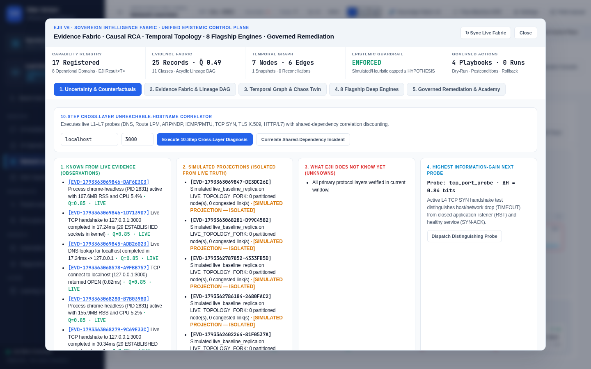

* **4-Column Epistemic Truth Matrix**:
  1. **Known from Live Evidence (Observations)**: Cryptographically tagged evidence records (`EVD-*`) with quality score $Q$ and provenance.
  2. **Simulated Projections (Isolated from Live Truth)**: Explicitly quarantined `M/M/1/K` digital-twin projections that can never pollute live operational state.
  3. **What EJII Does Not Know Yet (Unknowns)**: Transparent disclosure of unprobed protocol layers or sandbox boundaries.
  4. **Highest Information-Gain Next Probe**: Recommends the next diagnostic probe ranked by Shannon entropy reduction ($\Delta H$ in bits).

---

### 2.12 Responsive Mobile & Field Operator Experience (`390×844`)

<div align="center">
  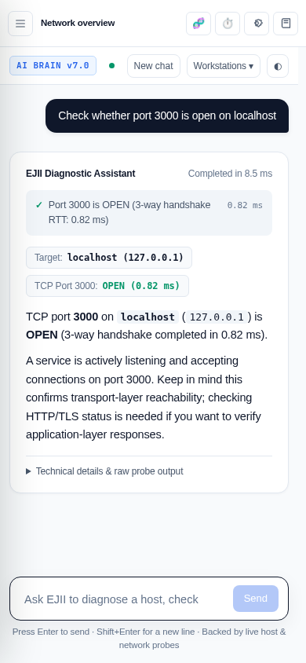
</div>

* **Field-Ready Compact Viewport**: Automatically collapses desktop command ribbons and adapts the navigation drawer, topbar actions, and conversational diagnostic cards for zero-horizontal-scroll operation on mobile devices (`390×844` and `768×1024`).

---

## 3. System Architecture & Dataflow

<div align="center">
  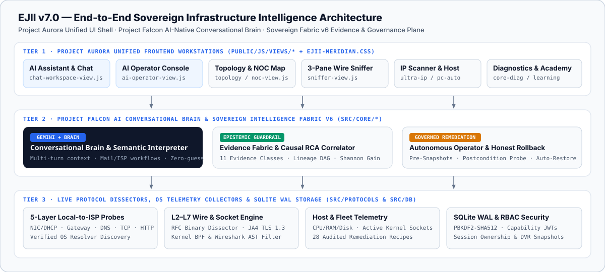
</div>

### 3.1 End-to-End Request & Evidence Lifecycle

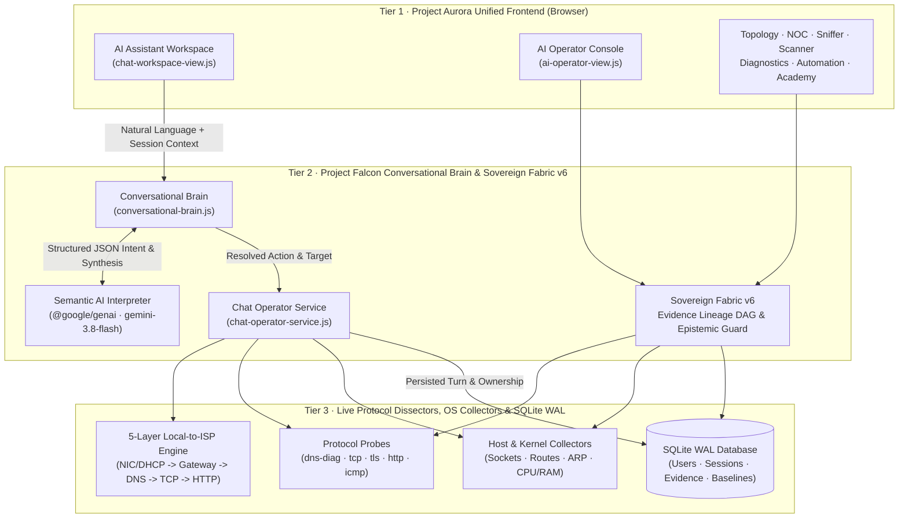
```mermaid
flowchart TB
    subgraph UI["Tier 1 · Project Aurora Unified Frontend (Browser)"]
        ChatUI["AI Assistant Workspace\n(chat-workspace-view.js)"]
        OpUI["AI Operator Console\n(ai-operator-view.js)"]
        Workstations["Topology · NOC · Sniffer · Scanner\nDiagnostics · Automation · Academy"]
    end

    subgraph Brain["Tier 2 · Project Falcon Conversational Brain & Sovereign Fabric v6"]
        ConvBrain["Conversational Brain\n(conversational-brain.js)"]
        Gemini["Semantic AI Interpreter\n(@google/genai · gemini-3.8-flash)"]
        ChatOp["Chat Operator Service\n(chat-operator-service.js)"]
        EvFabric["Sovereign Fabric v6\nEvidence Lineage DAG & Epistemic Guard"]
    end

    subgraph Probes["Tier 3 · Live Protocol Dissectors, OS Collectors & SQLite WAL"]
        LocalISP["5-Layer Local-to-ISP Engine\n(NIC/DHCP -> Gateway -> DNS -> TCP -> HTTP)"]
        Proto["Protocol Probes\n(dns-diag · tcp · tls · http · icmp)"]
        HostOS["Host & Kernel Collectors\n(Sockets · Routes · ARP · CPU/RAM)"]
        DB[("SQLite WAL Database\n(Users · Sessions · Evidence · Baselines)")]
    end

    ChatUI -->|"Natural Language + Session Context"| ConvBrain
    ConvBrain <-->|"Structured JSON Intent & Synthesis"| Gemini
    ConvBrain -->|"Resolved Action & Target"| ChatOp
    ChatOp --> LocalISP & Proto & HostOS
    OpUI & Workstations --> EvFabric
    EvFabric --> Proto & HostOS & DB
    ChatOp -->|"Persisted Turn & Ownership"| DB
```

---

## 4. Project Falcon — AI-Native Conversational Intelligence

EJII's conversational engine (`src/core/chat/conversational-brain.js`, `src/core/chat/semantic-ai-interpreter.js`, and `src/core/chat/chat-operator-service.js`) is architected to behave like a senior infrastructure engineer—never a rigid keyword parser.

### 4.1 Multi-Turn Contextual Reasoning & Pronoun Resolution

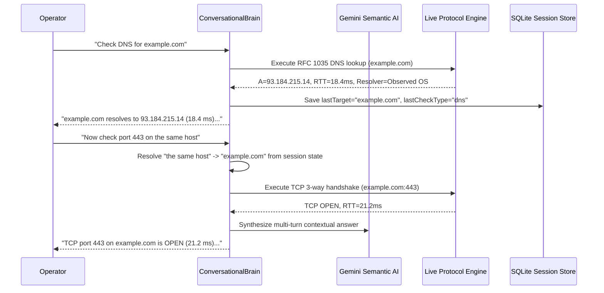
```mermaid
sequenceDiagram
    participant User as Operator
    participant Brain as ConversationalBrain
    participant LLM as Gemini Semantic AI
    participant Probes as Live Protocol Engine
    participant DB as SQLite Session Store

    User->>Brain: "Check DNS for example.com"
    Brain->>Probes: Execute RFC 1035 DNS lookup (example.com)
    Probes-->>Brain: A=93.184.215.14, RTT=18.4ms, Resolver=Observed OS
    Brain->>DB: Save lastTarget="example.com", lastCheckType="dns"
    Brain-->>User: "example.com resolves to 93.184.215.14 (18.4 ms)..."

    User->>Brain: "Now check port 443 on the same host"
    Brain->>Brain: Resolve "the same host" -> "example.com" from session state
    Brain->>Probes: Execute TCP 3-way handshake (example.com:443)
    Probes-->>Brain: TCP OPEN, RTT=21.2ms
    Brain->>LLM: Synthesize multi-turn contextual answer
    Brain-->>User: "TCP port 443 on example.com is OPEN (21.2 ms)..."
```

### 4.2 Guided Multi-Turn Troubleshooting Workflows

* **Email Service Troubleshooting (`mail_troubleshooting`)**:
  * When a user says *"My email is not working"* or *"I cannot login to my mail"*, EJII never confuses external email troubleshooting with EJII's own sign-in screen.
  * Instead, it asks which email provider or domain is affected (e.g., `gmail.com`, `outlook.com`, or a custom corporate mail domain) and whether the failure occurs in a browser or a mail client (Outlook/Apple Mail/Thunderbird).
  * Once the user replies (e.g., *"gmail.com in browser"*), EJII automatically runs a coordinated multi-probe check (DNS resolution, MX record lookup, HTTPS webmail reachability, and SMTP/IMAP submission ports `993`/`587`/`465`) and synthesizes a clear diagnosis.
* **5-Layer Local-to-ISP Connectivity Diagnosis (`local_network_diagnosis`)**:
  * When a user reports *"Internet is not working on this machine"* or *"Check my local network and ISP connection"*, EJII executes a structured 5-layer diagnostic progression:
    1. **Layer 1 — Network Interface & DHCP Status**: Inspects active non-loopback NICs, IPv4/IPv6 addresses, and real OS DHCP lease status (`dhcpEnabled`, `dhcpServer`, `verificationMethod`).
    2. **Layer 2 — Default Gateway Reachability**: Discovers the real OS default route (`ip route` / `/proc/net/route` / `route print`) without hardcoded `192.168.1.1` fallbacks and probes gateway reachability.
    3. **Layer 3 — System DNS Resolver Health**: Verifies the actual OS-configured DNS server (`resolvectl`, `scutil --dns`, `/etc/resolv.conf`, `Get-DnsClientServerAddress`), distinguishing local stub resolvers (`127.0.0.53`) from upstream resolvers.
    4. **Layer 4 — External TCP Reachability**: Tests direct TCP transport connectivity (`1.1.1.1:443`) to isolate DNS failures from routing/ISP drops.
    5. **Layer 5 — External HTTP/HTTPS Reachability**: Verifies end-to-end DNS + TLS + HTTP application-layer connectivity.

---

## 5. Epistemic Integrity & Zero-Fabrication Engineering

EJII enforces strict engineering guardrails across every backend collector and frontend view:

| Engineering Guarantee | Implementation File(s) | Verification Behavior |
| :--- | :--- | :--- |
| **Native Gemini Function Calling & Iterative Reflection Loop** | `src/core/chat/conversational-brain.js`, `src/core/chat/semantic-ai-interpreter.js` | Passes all 15 `EJII_FUNCTION_DECLARATIONS` (including `snmp_walk`, `office_device_resolve`, and `tls_posture_audit`) to `@google/genai`, maps every tool call deterministically via `mapFunctionCallToExecutionPlan()`, and runs a bounded 3-step `Plan -> Execute -> Observe -> Reflect` loop (`runAgenticToolLoop`). |
| **Mathematical Shannon Information Gain & 12-Probe Bayesian Matrix** | `src/core/chat/conversational-brain.js`, `src/core/evidence/evidence-fabric.js` | Computes exact expected Shannon Information Gain $IG(X; Y) = H(X) - \sum_{y \in \{\text{pass},\text{fail}\}} P(Y=y) H(X \mid Y=y)$ across a 12-probe candidate matrix spanning all 6 fault domains (DNS Wire, TCP Connect, HTTPS L7, ARP Neighbor, ICMP Gateway Ping, Traceroute WAN, TLS Posture, DNS MX, SSH, Database Port, Kernel Sockets, Host Resources). Performs dynamic in-loop Bayesian posterior updates $P(X=x_i \mid Y=y) = \frac{P(Y=y \mid X=x_i) P(X=x_i)}{P(Y=y)}$ upon probe execution, and links directly to `evidenceFabric` DAG lineage hashes. Never labels unobserved posteriors as `OBSERVED_CONCLUSIVE`. |
| **Standardized EJIIResult<T> Error Contract & Protocol Envelopes** | `src/core/contracts/ejii-result.js` | Guarantees every capability, probe outcome, and diagnostic error conforms to the standardized `EJIIResult<T>` envelope (`ok`, `success`, `capabilityId`, `status`, provenance metadata `source: { module, method, privilege, platform, fidelity }`, `observedAt`, `data`, and standardized `error: { code, message, category, recoverable }`). Enables seamless error handling across all 9 protocol engines. |
| **Automated TypeScript/JavaScript Module Parity Guard** | `scripts/verify-ts-js-parity.js`, `scripts/lint-all.js` | Enforces continuous 100% AST, export, and prototype method parity across all 22 TypeScript flagship modules and their runtime JavaScript counterparts with zero build drift, executed as Step 2b of the comprehensive project linter. |
| **Autonomous War Room Automated Key Rotation & Receipt Replay TTL** | `src/ai/autonomous-war-room.ts`, `src/ai/autonomous-war-room.js` | Automates cryptographic HMAC key rotation via configurable age policy (`maxAgeMs: 4h`) and volume threshold (`maxReceiptsBeforeRotation: 10,000`), enforces strict 1-hour expiration TTL and future clock skew rejection on `CollectorExecutionReceipts`, and blocks cross-session receipt replay. |
| **Comprehensive Sliding-Window Rate Limiting & DoS Protection** | `src/api/rate-limiter.js`, `src/server.js` | Mounts sliding-window in-memory rate limiting across `/api/chat/*`, `/api/v6/chat/*`, `/api/enterprise/*`, `/api/v6/*`, `/api/atlas/*`, and `/api/diagnostics/*` with standard `X-RateLimit-Limit`, `X-RateLimit-Remaining`, `X-RateLimit-Reset`, and `Retry-After` headers. |
| **Genuine Live UDP SNMP Interrogation, Subtree SSRF Guards & Multi-Signal Provenance** | `src/protocols/snmp-engine.js`, `src/core/agent/edge-agent-service.js`, `src/api/routes-enterprise.js` | Polls live network switches, routers, and daemons using `net-snmp` on UDP port 161 (`telemetryProvenance: 'LIVE_SNMP_HARDWARE'`, `isAuthoritativeSnmp: true`) and enforces `resolveAndValidateTarget` (SSRF + DNS-rebinding IP pinning) and ASN.1 OID syntax validation (`isValidOidSubtree`) across both scalar probes and OID subtree walks (`walkOid`, `walkInterfaces`). Strictly marks TCP/ICMP fallback profiles with `applicationHealthProven: false` and `telemetryProvenance: 'INFERRED_MULTI_SIGNAL'`. |
| **OS-Native Dual-Stack ICMP Ping (IPv4/IPv6)** | `src/protocols/icmp-ping.js` | Dispatches real OS ICMP Echo requests with platform-specific IPv6 flags (`-6`) and RFC-compliant address sanitization; returns `fidelity: 'REAL_OS_ICMP_ECHO'` and exact round-trip latencies. |
| **No Assumed DNS Resolver Fallbacks** | `src/protocols/dns-diag.js` (`getRealSystemDns`) | Never substitutes `8.8.8.8` when OS resolver discovery is unavailable. Explicitly classifies `observed_os_config`, `local_stub_resolver`, or `unknown` with collection provenance. |
| **Zero Fabricated Timing or Disk Values** | `src/core/chat/chat-operator-service.js`, `src/protocols/host-metrics.js` | Eliminates synthetic fallback durations and fabricated Windows disk capacities; separates POSIX CPU tick delta (`posix_cpu_tick_delta`) from `os.loadavg()` (`loadAverage1m/5m/15m`). |
| **No Hardcoded Gateway Fallbacks** | `src/protocols/host-metrics.js` (`getVerifiedDefaultGateway`) | Never fabricates `192.168.1.1` when the OS routing table cannot be read; returns `gatewayIp: null, verified: false, reason: 'NO_DEFAULT_ROUTE_OBSERVED'`. |
| **Zero-Latency Hybrid Reflex, Cross-Turn Context Isolation & Dynamic Capability Discovery** | `src/core/chat/chat-operator-service.js`, `src/core/chat/conversational-brain.js`, `src/core/chat/semantic-ai-interpreter.js` | Executes deterministic operator probes via `ZERO_LATENCY_LOCAL_REFLEX` (including ping, port checks, DNS, website, traceroute, SNMP walk, office device resolution, and TLS posture audit), isolates and purges stale target/port state on rapid domain pivots (`contextPivotDetected`), and dynamically introspects runtime capabilities (`discoverDynamicRuntimeCapabilities`, `getDynamicFunctionDeclarations`) with strict callable method verification (`isGenuinelyCallable: true`) so discovered filenames are never claimed without operational code. |
| **Simulated vs. Live Evidence Isolation** | `src/core/evidence/evidence-fabric.js` | Every `M/M/1/K` digital-twin simulation record carries `isolatedFromLiveTruth: true` and is capped at `HYPOTHESIS` confidence so simulations never masquerade as live wire truth. Distinct `[LIVE PRODUCTION]` vs `[SIMULATION LAB]` badges are rendered across all NOC workstations. |
| **Authoritative 3-Tier Remediation Governance & Loopback Security** | `src/core/governance/remediation-governance.js`, `src/config.js`, `src/api/routes-enterprise.js` | Restricts remediation execution through a tamper-evident gate (`ADVISORY`, `CONTROLLED_CANARY`, `RESTRICTED_AUTONOMOUS`); enforces SSRF target validation (`isSafeNetworkTarget`) across enterprise SNMP, RCA, diagnostics, and agent routes; and strictly separates wildcard `0.0.0.0` binding from local loopback (`127.0.0.1`/`::1`). |
| **Durable Edge-Agent Outbox, Lease Epoch Lifecycle & Cryptographic Credential Governance** | `src/core/agent/edge-agent-service.js`, `src/core/agent/edge-agent-daemon.js`, `src/api/routes-enterprise.js` | Replaces static default tokens with HMAC-SHA256 runtime-derived credentials (`deriveAgentCredential`), 256-bit enrollment tokens, live key rotation (`rotateAgentCredential`), and agent revocation (`revokeAgent`); persists offline task results in a SQLite WAL table (`edge_agent_durable_outbox`) + atomic disk outbox across daemon restarts; and rejects stale lease epochs with HTTP `409 STALE_LEASE_EPOCH_IGNORED`. |
| **Calibrated 6-Domain Specialist Consensus & Evidence-Driven Closed-Loop Verification** | `src/core/cognition/cognitive-intelligence-engine.js`, `src/core/unified-investigation-engine.js` | Computes actual empirical domain coverage (`observedDomainCount / 6`), applies sparse-data damping (`sparseDataDampingApplied`) when `< 3` domains are observed, surfaces `specialistDisagreements` and `evidenceWeightingRationale`, enforces target/scope safety (`rejectedOutOfScopeProbes`) and probe deduplication (`deduplicatedSkippedProbes`), and recalculates closed-loop confidence purely from empirical evidence—reducing confidence and pivoting the hypothesis (`HYPOTHESIS_PIVOTED_ON_CONTRADICTORY_EVIDENCE`) when follow-up probes uncover contradictory findings. |
| **Zero-Loss Telemetry Distillation & Shannon Information-Gain Dynamic Probes** | `src/core/chat/conversational-brain.js` | Distills high-volume raw probe payloads (TCP port tables, DNS RR sets, traceroute hop matrices) into high-entropy summaries with percentiles (`min`, `max`, `median`, `p95`) for LLM context limits; dynamically calculates mathematical Shannon Information Gain ($\Delta H$ bits) across candidate probes to select optimal disambiguation tests under epistemic uncertainty (`epistemicClassification`). |
| **Topological Incident Isomorphism & Longitudinal Causal Memory** | `src/core/memory/operational-memory-engine.js` | Traverses historical incident resolutions in SQLite WAL to compute topological and symptom graph isomorphism (`queryTopologicalIncidentIsomorphism`), correlating recurrent network blast-radius patterns with proven remediation playbooks. |
| **Autonomous War Room Epistemic Abstention & Temporal Post-Remediation Verification** | `src/ai/autonomous-war-room.ts`, `src/ai/autonomous-war-room.js` | Cryptographically validates HMAC-signed collector receipts, enforces mandatory epistemic abstention (`enforceEpistemicAbstention`) when contradictory or unverified evidence is detected, and validates multi-sample post-remediation stability across a sliding temporal window (`executeTemporalPostRemediationVerification`). |
| **Line-Rate Wire Ring Buffer & Kernel Backpressure Telemetry** | `src/network/packet-streaming/packet-streamer.js` | Exposes real-time ring buffer saturation (`getBackpressureMetrics`), packet delivery counters, overrun drop metrics, and memory utilization under line-rate socket streaming. |
| **Active-Active/Passive Capacity RCA, Clock-Skew Patient Zero & 4-Tier Causal Certainty** | `src/core/rca-engine.js`, `src/core/topology/temporal-graph-engine.js`, `src/core/memory/operational-memory-engine.js` | Distinguishes healthy failover (`DEGRADED_REDUNDANCY_FAILOVER_ACTIVE`), partial quorum capacity overload (`PARTIAL_QUORUM_CAPACITY_DEGRADED`), and failback synchronization (`FAILBACK_SYNCHRONIZATION_IN_PROGRESS`); accounts for clock-skew tolerance (`AMBIGUOUS_WITHIN_CLOCK_SKEW`) and unreliable timestamps when isolating Patient Zero in circular SCCs; classifies candidate nodes into `CONFIRMED_ROOT_CAUSE`, `PROBABLE_CAUSE`, `CONTRIBUTING_FACTOR`, and `UNRESOLVED_POSSIBILITY`; and detects multiple independent root causes (`hasMultipleIndependentRootCauses`). |
| **Autonomous Closed-Loop 6-Domain Hypothesis Arbiter, Non-Linear Predictive Horizon, Patient Zero CUSUM Timeline & Composable Superpowers** | `src/ai/hypothesis-arbiter.js`, `src/ai/predictive-horizon-engine.js`, `src/observability/timeline-reconstructor.js`, `src/core/skills/superpowers-skills-engine.js` | Arbitrates competing root causes across 6 domains (`PHYSICAL_L2_L3`, `TRANSPORT_L4`, `APPLICATION_L7`, `DNS_NAMING`, `HOST_KERNEL_SOCKET`, `SECURITY_TLS_POLICY`) conditioned on persistent Operational Memory & Incident DNA priors; autonomously executes the highest-information-gain diagnostic probes ($\Delta H$ bits) in real time; models non-linear $M/M/1$ queueing saturation cliffs ($\Phi(\rho) = \rho / (1 - \rho)$) and Tarjan cut-vertex SPOFs; reconstructs un-truncated pre-incident timelines via MAD + Page's CUSUM changepoint detection; and orchestrates all 8 `obra/superpowers` skills (`find-skills`, `grill-me`, `writing-plans`, `systematic-debugging`, `subagent-driven-development`, `verification-before-completion`, `self-improving-agent`, `agent-browser`) in parallel without `if / else if` siloing. |
| **Unified 7-Engine Cognitive Core, Counterfactual Disambiguation & Executable Runbook Governance (`RB-01`–`RB-08`)** | `src/ai/cusum-changepoint-engine.ts`, `src/ai/spectral-fourier-detector.ts`, `src/ai/holt-winters-forecaster.ts`, `src/ai/neuro-symbolic-apex.ts`, `src/ai/autonomous-war-room.ts`, `src/ai/hypothesis-arbiter.js`, `src/ai/predictive-horizon-engine.js`, `src/api/routes-enterprise.js` | Unites all 7 AI engines via closed-loop cognitive feedback: adaptive multi-metric CUSUM (`evaluateAdaptiveMultiMetricTrace`), Spectral FFT periodic anomaly priors (`synthesizeCognitiveFeedback`), multi-resource Time-to-Criticality (`generateAdaptiveTtcForecasts` & `timeToCriticalityMatrix`), Neuro-Symbolic compound counterfactual synthesis (`evaluateCompoundCounterfactualSynthesis`), and interactive execution of `RB-01` through `RB-08` with continuous `POL-01`/`POL-02` desired-state drift governance (`/api/enterprise/desired-state-drift`) and Socratic lab mentorship (`/api/enterprise/socratic-mentor`). |
| **Episodic Causal Memory Engine, Multi-Turn Bayesian Field Steering & Universal Situational Memory** | `src/ai/episodic-causal-memory-engine.ts`, `src/api/routes-enterprise.js`, `public/js/app.js` | Implements cosine-similarity Experience Replay against historical incident fingerprints (`/api/enterprise/episodic-memory`), multi-hop upstream root-cause vs. downstream sympathetic victim separation (`analyzeCausalBlastRadius`), dynamic emergent compound hypotheses beyond fixed buckets, live mathematical counterfactuals from numerical telemetry deltas, closed-loop post-action Bayesian weight self-calibration (`recalibrateOnActionOutcome`), multi-turn semantic field observation steering (`/api/enterprise/steer-observation`), and SQLite-backed cross-workstation Situational Memory (`/api/enterprise/situational-memory`). |
| **Strict Session Ownership & RBAC** | `src/server.js`, `src/core/security.js` | Every chat session and diagnostic history record is bound to `ownerUserId`. Non-owners receive `403 Forbidden` on read, write, and delete operations. |
| **Concurrent Orthogonal Shannon Information Gain Multi-Probe Loop & Compound Bayesian Updates** | `src/core/chat/conversational-brain.js`, `src/core/evidence/evidence-fabric.js` | Evaluates the 12-probe candidate matrix to compute optimal concurrent, non-conflicting multi-probe sets spanning orthogonal OSI layers (L3 network, L4 transport, L7 application). Dispatches probes in parallel via bounded `Promise.allSettled`, integrates sequential compound Bayesian posterior updates with entropy reduction $\Delta H$, and strictly prevents competing probes on identical socket/port resources. |
| **Episodic Incident Memory Feedback into Empirical Bayesian Diagnostic Priors** | `src/core/memory/operational-memory-engine.js`, `src/core/chat/conversational-brain.js` | Traverses historical incident resolutions and operational memory to derive empirical fault distributions over the 9 canonical diagnostic hypotheses ($P_{\text{empirical}}$) smoothed with symmetric Dirichlet priors ($\alpha = 0.5, K = 9$). Dynamically blends empirical and baseline priors ($P_{\text{blended}} = 0.6 \cdot P_{\text{empirical}} + 0.4 \cdot P_{\text{prior}}$) ensuring mathematically valid Shannon information gain calculations without fallback to `UNAVAILABLE_NO_PRIOR`. |
| **Protocol Modernization: IPv6 Bracketed Literals, Active QUIC HTTP/3, and SNMPv3 USM** | `src/core/security.js`, `src/protocols/http-probe.js`, `src/protocols/snmp-engine.js`, `src/protocols/service-verifier.js`, `src/protocols/tcp-port.js` | Enhances SSRF parsing to support bracketed IPv6 literals with explicit ports (`[::1]:443`, `[2001:db8::1]:8080`), performs active RFC 9000 QUIC version negotiation probes using 1200-byte minimum datagrams alongside RFC 7838 `Alt-Svc` header parsing, and adds full SNMPv3 User-based Security Model (`authPriv` with SHA/AES, `authNoPriv`, and `noAuthNoPriv`) sessions. |
| **Persistent Evidence DAG & 2-Hop Weisfeiler-Leman Topological Graph Kernel Isomorphism** | `src/core/evidence/evidence-fabric.js`, `src/core/memory/operational-memory-engine.js`, `src/db/database.js` | Persists evidence DAG vertices and edges into SQLite WAL (`evidence_fabric_nodes`, `evidence_fabric_edges`) with complete boot-time DAG restoration. Upgrades topological incident retrieval to a 2-hop Weisfeiler-Leman (`2-WL`) subtree graph kernel computing cosine similarity over multiset color histograms for exact graph isomorphism detection. |
| **Distributed Trace Propagation, Mutating CSRF Origin Defense, and Bounded Graceful Teardown** | `src/api/middleware.js`, `src/api/routes-diagnostics-remediation.js`, `src/server.js` | Propagates distributed trace IDs (`x-ejii-trace-id` / `x-trace-id`) across request telemetry, validates Fetch Metadata (`Sec-Fetch-Site`) and `Origin` headers on mutating remediation endpoints to prevent cross-site execution attacks, and closes idle HTTP connections with a 5000ms safety timeout guard during graceful shutdown. |
| **Dynamic Bayesian Prior Auto-Calibration with Exponential Decay & Adaptive Entropy Stopping** | `src/core/memory/operational-memory-engine.js`, `src/core/chat/conversational-brain.js` | Computes time-decayed empirical incident weights ($w_i = \text{baseWeight} \cdot e^{-\Delta t_i / \tau}$, $\tau = 7\text{ days}$) across historical resolutions to calibrate live Bayesian diagnostic priors. Evaluates live residual Shannon entropy ($H(X) < 0.35\text{ bits}$) and dominant hypothesis confidence ($\ge 88.0\%$) to terminate agentic diagnostic loops early (`ENTROPY_CONFIDENCE_THRESHOLD_REACHED`) once causal certainty is achieved. |
| **Continuous Laplacian Graph Heat Diffusion & Causal Blast Radius** | `src/core/topology/temporal-graph-engine.js`, `src/core/evidence/evidence-fabric.js` | Calculates continuous graph heat diffusion $\mathbf{p}_t = \exp(-t \mathbf{L}) \cdot \mathbf{v}_0$ via a 6-term Taylor expansion on the graph Laplacian matrix $\mathbf{L} = \mathbf{D} - \mathbf{A}$, computing continuous degradation probability contours ($0.0 \le p_i \le 1.0$) across downstream dependencies and persisting causal blast-radius DAG edges into SQLite WAL (`DIFFUSION_BLAST_RADIUS`). |
| **High-Speed Ring Buffer Dual Watermarks & Wireshark AST Boolean Compiler** | `src/network/packet-streaming/packet-streamer.js`, `public/js/components/filter-compiler.js`, `src/sniffer/wire-dissector-apex.ts`, `src/sniffer/wire-dissector-apex.js` | Enforces dual watermarks (75% high / 25% low) on `HighSpeedPacketRingBuffer` with active `BACKPRESSURE_WARNING` state emissions and drop counters under line-rate socket streaming. Compiles Wireshark display filter AST expressions into zero-copy evaluators supporting deep dot-notation paths (`tcp.flags.syn`, `ip.src`, `http.status`, `dns.answers.type`) with strict operator precedence. |
| **Smooth Signal Temporal Logic (S-STL) & Analytical Sensitivity Gradients** | `src/ai/neuro-symbolic-apex.ts`, `src/ai/neuro-symbolic-apex.js` | Replaces non-differentiable $\min$/$\max$ operators with smooth Log-Sum-Exp approximations ($\text{LSE}_\beta$, $\beta = 10.0$) in Continuous Signal Temporal Logic robustness evaluation ($\tilde{\rho}$). Computes exact analytical sensitivity gradients ($\nabla_\mu \rho$) identifying bottleneck telemetry dimensions, and forecasts continuous Time-to-Violation (TTV) horizons via linear velocity extrapolation. |
| **Closed-Loop Conversational Remediation Gate & Signed HMAC Action Tokens** | `src/core/chat/conversational-brain.js`, `src/systems/remediation/autonomous-remediation-engine.js` | Formulates explicit dual-custody remediation proposals on dominant diagnostic hypotheses, issues cryptographically signed HMAC action tokens with 5-minute expiration TTL, executes governed safe runbooks, and verifies temporal postcondition stability with anti-replay protection. |
| **Continuous Laplacian Heat Diffusion in RCA Engine & Diffusion Contours API** | `src/core/rca-engine.js`, `src/core/topology/temporal-graph-engine.js`, `src/api/routes-v6-fabric.js` | Integrates continuous Laplacian graph heat diffusion $\mathbf{p}_t = \exp(-t \mathbf{L}) \cdot \mathbf{v}_0$ directly into multi-hop RCA symptom disambiguation. Assigns continuous degradation probabilities ($0.0 \le p_i \le 1.0$) and contour levels (`CRITICAL_HEAT`, `HIGH_DEGRADATION`, `MODERATE_DIFFUSION`, `MARGINAL_EXPOSURE`) across causal propagation chains, exposed via `/api/v6/temporal-graph/diffusion-contours/:sourceNodeId`. |
| **Sensitivity-Gradient-Weighted Shannon Information Gain Probe Selection** | `src/core/chat/conversational-brain.js`, `src/ai/neuro-symbolic-apex.ts` | Couples analytical sensitivity gradients ($\nabla_{\mu_k} \tilde{\rho}$) from Smooth STL robustness margins with candidate probe Shannon information gain: $IG_{\text{weighted}}(X; Y_k) = IG(X; Y_k) \cdot (1 + \gamma \cdot \nabla_{\mu_k} \tilde{\rho})$, dynamically prioritizing probes that target physical bottleneck layers while preserving 100% backward compatibility when margins are absent. |
| **High-Throughput Binary WebSocket Frame Streaming for Line-Rate Cockpit** | `src/network/packet-streaming/binary-frame-codec.js`, `src/network/packet-streaming/packet-streamer.js`, `src/server.js` | Replaces high-overhead JSON serialization with compact, deterministic 32-byte (IPv4) / 56-byte (IPv6) binary framed packet streaming (`0x454A4949`, version 1, flags, microsecond timestamps, ports, wire lengths, payload clipping). Supports `binary-stream` / `ejii-binary-v1` WebSocket subprotocol negotiation with zero-copy browser DataView decoding. |
| **Event-Driven Episodic Memory Bus & Universal Experience Replay** | `src/core/memory/operational-memory-engine.js`, `src/ai/episodic-causal-memory-engine.ts`, `src/core/chat/conversational-brain.js` | Transforms operational memory into an event-driven bus emitting `INCIDENT_RESOLUTION_COMMITTED` on verified fixes. Automatically indexes incidents into episodic causal memory and provides universal experience replay via composite similarity ranking (45% cosine vector, 35% 2-hop Weisfeiler-Leman graph kernel, 20% domain tags), surfacing historical winning runbooks directly within conversational diagnostics. |
| **Closed-Loop Autonomous Rollback Watchdog & Control Barrier Safety Invariants (CBF)** | `src/core/chat/conversational-brain.js`, `src/systems/remediation/autonomous-remediation-engine.js` | Evaluates safety barrier invariants across post-action telemetry: latency ceiling $h_{\text{rtt}} \ge 0$, packet loss ceiling $h_{\text{loss}} \ge 0$, and Lyapunov energy descent $h_{\text{lyapunov}} \ge 0$. Automatically dispatches compensating rollback recipes within sub-second thresholds upon invariant violation and records signed tamper-resistant HMAC audit trail entries. |
| **Dynamic Temporal Granger Causal Discovery & Topological Prior Wiring** | `src/core/topology/temporal-graph-engine.js`, `src/core/chat/conversational-brain.js`, `src/db/database.js` | Discovers directed causal relationships between infrastructure telemetry streams using Ordinary Least Squares (OLS) autoregressive modeling with exact analytical closed-form $p$-values for lag-2 models ($p = (1 + \frac{2}{df_2} F)^{-df_2/2}$). Persists discovered causal graph edges into SQLite WAL (`temporal_causal_edges`) and wires causal topological ancestry directly into Bayesian prior initialization for information-gain diagnostic loops. |
| **Socratic Multi-Turn Disambiguation & Active Clarification Loop** | `src/core/chat/conversational-brain.js` | Automatically formulates discriminative, contrastive Socratic clarification queries when residual entropy is high ($H(X) > 1.2\text{ bits}$) and automated probes are exhausted. Ingests operator responses to collapse posterior entropy ($H < 0.8\text{ bits}$) and safely disambiguate competing root causes. |
| **Line-Rate Binary Packet Cockpit Offscreen Worker & Equipotential Diffusion Shader** | `public/js/workers/packet-binary-decoder-worker.js`, `public/js/equipotential-contour-shader.js`, `public/js/views/topology-view.js`, `public/js/views/sniffer-view.js` | Offloads binary packet decoding (IPv4 32-byte & IPv6 56-byte frames) to a dedicated Web Worker via `DataView` with a 10,000-frame circular ring buffer and 60Hz batch emitter. Renders continuous Laplacian scalar potential fields $u(x, y) = \sum_k u_k \exp(-\text{dist}_k^2 / (2\sigma_k^2))$ and equipotential contour rings on high-performance canvas overlays across Topology and Packet Sniffer workstations. |
| **Episodic Playbook Lifecycle Governance & Degradation Quarantine** | `src/core/memory/operational-memory-engine.js`, `src/ai/episodic-causal-memory-engine.ts`, `src/ai/episodic-causal-memory-engine.js` | Governs remediation playbooks across a 5-state lifecycle (`CANDIDATE` $\to$ `VERIFIED_ACTIVE` $\to$ `PROBATIONARY` $\to$ `QUARANTINED_DEGRADED` $\to$ `SUPERSEDED`). Automatically transitions failing playbooks to `PROBATIONARY` and quarantines them on $\ge 2$ consecutive failures with HMAC audit trails, excluding them from Experience Replay recommendations while permitting operator rehabilitation. |
| **Continuous Morlet Wavelet Transform & Hurst Long-Range-Dependence (LRD) Engine** | `src/ai/wavelet-hurst-lrd-engine.ts`, `src/ai/wavelet-hurst-lrd-engine.js`, `src/ai/predictive-horizon-engine.js` | Evaluates continuous Morlet Wavelet Transform ($\psi(u) = \pi^{-1/4} \exp(i \omega_0 u) \exp(-u^2 / 2)$, $\omega_0 = 6.0$) across dyadic octave scales $a \in [2, 4, 8, 16, 32, 64]$ to detect localized high-frequency microbursts ($E(2) / \bar{E}_{4,8} > 2.0$), computes empirical Rescaled Range ($R/S$) Hurst exponent ($H$) via linear regression, and dynamically inflates non-linear predictive queueing horizons using LRD dispersion multiplier $\kappa_{\text{LRD}} = n^{2H - 1}$. |
| **Dimension-Expanded 512D -> 64D Telemetry Embeddings & Johnson-Lindenstrauss Isometry** | `src/ai/dimension-expanded-embedding-engine.ts`, `src/ai/dimension-expanded-embedding-engine.js`, `src/core/memory/operational-memory-engine.js`, `src/ai/episodic-causal-memory-engine.ts` | Breaks free from fixed-schema 8D telemetry vectors by projecting arbitrary open-ended sparse metrics (up to 512D) into a dense 64D metric space using an orthogonal Achlioptas random matrix $R_{i,j} \in \{+\sqrt{3/k}, 0, -\sqrt{3/k}\}$ with probabilities $\{1/6, 2/3, 1/6\}$. Guarantees isometric Euclidean distance preservation ($\epsilon < 0.15$) for high-fidelity Experience Replay across heterogeneous infrastructure fleets. |
| **Multi-Tier Topological Target Disambiguation & Operational Temporal Scope Engine** | `src/core/chat/conversational-brain.js`, `src/core/topology/temporal-graph-engine.js`, `src/core/memory/operational-memory-engine.js` | Disambiguates candidate topological nodes from user input against the Temporal Infrastructure Graph using multi-token matching, resource-type weighting, health degradation bias (+0.20 for `DEGRADED`/`CRITICAL`), and threshold delta gating ($\Delta < 0.25$ triggers active Socratic inquiry). Resolves natural-language temporal scopes ('past 15m', 'today', 'recently') and operational anchors ('after reboot') correlated against real SQLite decision timestamps. |
| **Generative Neuro-Symbolic Remediation Synthesizer & Lyapunov Contraction Proofs** | `src/systems/remediation/generative-remediation-synthesizer.ts`, `src/systems/remediation/generative-remediation-synthesizer.js`, `src/core/chat/conversational-brain.js` | Synthesizes safe micro-remediation grammar primitives (`TCP_WINDOW_CLAMP`, `DNS_UPSTREAM_PIVOT`, `SOCKET_BUFFER_EXPEDITE`, `DSCP_TRAFFIC_SHAPE`), proves pre-execution Lyapunov stability invariant $\Delta V(s_t, a) = V(s_{t+1}) - V(s_t) \le -\delta < 0$ on positive definite energy $V(s) = \alpha \cdot \text{rtt}^2 + \beta \cdot \text{loss}^2 + \gamma \cdot \text{queue}^2$, derives exact algebraic compensating inverse actions ($a^{-1}$), and issues cryptographically signed HMAC dual-custody action tokens. |
| **Distributed Causal Loopy Belief Propagation & Cryptographic Byzantine Quorum Consensus** | `src/core/agent/distributed-belief-propagation.ts`, `src/core/agent/distributed-belief-propagation.js`, `src/core/agent/edge-agent-service.js` | Performs damped factor-graph message passing ($\lambda = 0.50$) across variable nodes and causal compatibility factors $\psi(X_i, X_j)$, collects HMAC-SHA256 signed belief reports from distributed edge daemons (`deriveAgentCredential`), achieves Byzantine fault tolerance ($\ge 2f + 1$ quorum out of $N \ge 3f + 1$) with symmetric KL divergence outlier filtering, and integrates resilient store-and-forward delivery via SQLite `edge_agent_durable_outbox`. |

---

## 6. Complete Capability Matrix

| Workstation / Domain | Key Modules | Core Capabilities |
| :--- | :--- | :--- |
| **1. AI Diagnostic Assistant** | `public/js/views/chat-workspace-view.js`<br>`src/core/chat/conversational-brain.js`<br>`src/core/chat/chat-operator-service.js` | Multi-turn natural-language diagnostics, Gemini 3.8 Flash semantic interpretation, 12-probe Shannon IG dynamic probe selection matrix spanning all 6 fault domains, analytical sensitivity-gradient-weighted Shannon information gain probe ranking ($\nabla_\mu \tilde{\rho} \cdot IG$), Multi-Tier Topological Target Disambiguation (`disambiguateTopologicalTarget`, health-degradation +0.20 bias, $\Delta < 0.25$ ambiguity inquiry), Operational Temporal Scope Resolution (`resolveTemporalScope`, 'past 15m', 'today', 'after reboot' SQLite decision anchor), closed-loop conversational remediation gate with cryptographically signed HMAC action tokens (`formulateRemediationGate`, anti-replay, 5m TTL, temporal Lyapunov postcondition stability verification), closed-loop autonomous rollback watchdog with Control Barrier Safety Invariants (CBF $h_{\text{rtt}}, h_{\text{loss}}, h_{\text{lyapunov}} \ge 0$), Socratic multi-turn conversational disambiguation on residual entropy peaks ($H > 1.2\text{ bits}$), dynamic Granger causal discovery prior wiring, universal episodic experience replay (`replayHistoricalExperiences`) with dimension-expanded 512D $\to$ 64D Achlioptas metric embeddings, 5-state playbook lifecycle governance and degradation quarantine (`CANDIDATE` $\to$ `VERIFIED_ACTIVE` $\to$ `PROBATIONARY` $\to$ `QUARANTINED_DEGRADED`), concurrent orthogonal multi-probe execution loop (`computeOptimalConcurrentProbes`), dynamic compound Bayesian posterior updates, episodic memory Dirichlet-smoothed prior blending, bounded 5-step agentic loop with budget awareness, zero-loss telemetry distillation (TLS, ICMP, HTTP, Host Resource, SNMP), pronoun/context resolution, non-mutually-exclusive multi-engine synthesis, Unified 7-Engine Situational Memory & Co-Pilot Action Ribbon (`#ejiiChatSituationalRibbon`), guided mail & ISP workflows, collapsible raw telemetry. |
| **2. Autonomous AI Operator** | `public/js/views/ai-operator-view.js`<br>`src/core/operator/autonomous-infrastructure-operator.js`<br>`src/systems/remediation/generative-remediation-synthesizer.js` | Continuous anomaly detection, natural-language goal planner, 4-agent AI Operations Council, Generative Neuro-Symbolic Remediation Synthesizer (`TCP_WINDOW_CLAMP`, `DNS_UPSTREAM_PIVOT`, `SOCKET_BUFFER_EXPEDITE`, `DSCP_TRAFFIC_SHAPE`) with pre-execution Lyapunov contraction proofs ($V(s_{t+1}) - V(s_t) \le -\delta < 0$) and algebraic compensating inverse actions ($a^{-1}$), interactive Closed-Loop Runbook Execution Bar (`RB-01`–`RB-08`), Multi-Turn Bayesian Field Observation Steering (`/api/enterprise/steer-observation`) with before/after posterior deltas, pre-snapshot self-healing, postcondition verification, bounded-concurrency (8 workers) topology reconciliation, honest auto-rollback, mutating CSRF defense, and graceful server teardown. |
| **3. Enterprise NOC Command Center** | `public/js/views/enterprise-noc-view.js`<br>`src/core/skills/superpowers-skills-engine.js`<br>`src/ai/wavelet-hurst-lrd-engine.js`<br>`src/ai/predictive-horizon-engine.js` | Multi-site fleet cards, live UDP SNMP interrogation, 6-Domain Closed-Loop Hypothesis Arbitration Tree with Counterfactual Disambiguation & Episodic Experience Replay, Continuous Morlet Wavelet Transform dyadic octave energy spectrum ($a \in [2, 4, 8, 16, 32, 64]$) with high-frequency microburst detection, Rescaled Range ($R/S$) Hurst exponent ($H \ge 0.68$) Long-Range-Dependence (LRD) dispersion multiplier forecasting ($\kappa_{\text{LRD}} = n^{2H - 1}$), Non-Linear $M/M/1$ Predictive Horizon & Time-to-Criticality (TTC) Matrix, Patient Zero CUSUM Timeline scrubber, Composable Superpowers runner, and SHA-256 audit ledger. |
| **4. Network Topology & NOC** | `public/js/views/topology-view.js`<br>`public/js/views/noc-view.js`<br>`src/core/evidence/evidence-fabric.js`<br>`src/core/topology/temporal-graph-engine.js`<br>`src/core/agent/distributed-belief-propagation.js` | L1–L6 hierarchical dependency graph, continuous Laplacian heat diffusion contours ($\mathbf{p}_t = \exp(-t \mathbf{L}) \cdot \mathbf{v}_0$), continuous equipotential contour shader overlay (`#laplacianDiffusionCanvas`) evaluating continuous potential fields $u(x, y) = \sum_k u_k \exp(-\text{dist}_k^2 / (2\sigma_k^2))$, dynamic temporal Granger causal discovery edges and ancestry, Distributed Causal Loopy Belief Propagation with damped updates ($\lambda = 0.50$), edge daemon HMAC-SHA256 signed belief reports, Byzantine quorum consensus ($\ge 2f + 1$), REST diffusion contour endpoints (`/api/v6/temporal-graph/diffusion-contours/:sourceNodeId`), Fiedler algebraic connectivity ($\lambda_2$), cut-vertex detection, LPM route trie, blast-radius simulator, Desired-State Drift overlays (`/api/enterprise/desired-state-drift/reconcile`), persistent SQLite DAG (`evidence_fabric_nodes`, `evidence_fabric_edges`), 2-hop Weisfeiler-Leman (`2-WL`) subtree graph kernel isomorphism, and live hop telemetry. |
| **5. 3-Pane Packet Analysis** | `public/js/views/sniffer-view.js`<br>`public/js/virtual-packet-cockpit.js`<br>`src/sniffer/wire-dissector-apex.js`<br>`src/network/packet-streaming/binary-frame-codec.js`<br>`public/js/workers/packet-binary-decoder-worker.js`<br>`public/js/components/filter-compiler.js`<br>`src/protocols/http-probe.js` | High-throughput zero-copy binary WebSocket frame streaming (`0x454A4949`, version 1, flags, microsecond timestamps, ports, wire lengths, payload clipping) with `binary-stream` / `ejii-binary-v1` subprotocol negotiation, dedicated line-rate offscreen Web Worker binary decoder (`packet-binary-decoder-worker.js`) with 10,000-frame circular ring buffer and 60Hz batch emitter, high-performance canvas packet waterfall (`#packetWaterfallCanvas`), live kernel socket & wire capture, L2–L7 binary header tree, TLS 1.3 JA4 fingerprinting, hex/ASCII inspector, RFC 9000 QUIC HTTP/3 version negotiation probing, RFC 7838 Alt-Svc detection, Kernel BPF & Wireshark AST filters, Advanced Multi-Clause Natural-Language-to-Filter AI Translator (`translateNaturalLanguageToFilter`), 1-click War Room stream escalation, FFT jitter & QoS studio. |
| **6. Ultra IP & Asset Scanner** | `public/js/views/ultra-ip-scanner-view.js`<br>`src/core/gitops-reconciliation-engine.js` | Multi-threaded subnet discovery, EDR-safe scan profiles, MAC OUI vendor resolution, open port auditing, printer/VoIP/APIPA classification, GitOps IaC drift detection against `policies/desired-infrastructure-state.json`, 1-click autonomous reconciliation, CSV/JSON/Print export. |
| **7. Core Diagnostics & RCA Workbench** | `public/js/views/core-diagnostics-view.js`<br>`src/core/rca-engine.js`<br>`src/core/topology/temporal-graph-engine.js`<br>`bin/run-diagnostics-cli.js` | 4-pillar host health X-ray, continuous Laplacian heat diffusion in multi-hop symptom disambiguation assigning continuous degradation probabilities ($0.0 \le p_i \le 1.0$) and contour levels (`CRITICAL_HEAT`, `HIGH_DEGRADATION`) across causal propagation chains, temporal Granger causality telemetry stream discovery ($F$-stat, analytical $p$-value, dynamic effect size $\Delta \sigma$), Control Barrier Function watchdog safety verification, degraded playbook quarantine ledger, 5-Agent War-Room root-cause arbitration, process-to-socket matrix, AI-augmented probe synthesis, staged remediation console, and standalone CLI (`ping`, `port`, `sweep`, `chain`, `superpowers`, `timeline`, `horizon`). |
| **8. Host Automation Library** | `public/js/views/pc-automation-view.js`<br>`src/tools/script-automation.js`<br>`policies/POL-01-zero-trust-rbac-and-ai-privacy-boundary.md` | 28 audited remediation & audit scripts across Network, Repair, Security, and Performance with risk-tier badges, structured `aiTelemetryInterpretation` output parsing, 6-Stage Deterministic Lyapunov Gate ($V(s_{t+1}) \le V(s_t)$ & Merkle root) monotonic descent verification, Closed-Loop `POL-01`/`POL-02` Policy Shield & Desired-State Drift verification, and streaming execution terminal. |
| **9. Sovereign Learning Center** | `public/js/views/learning-center-view.js`<br>`public/js/learning/labs/*`<br>`src/learning/ai-mentor-service.js` | 2 specialist academies (Network CCNA 200-301 & System Administration), 8 courses, 24 modules, 72 lessons, Deep Lab-Embedded Adaptive AI Socratic Tutor (`#ejiiSocraticMentorBar` & `window.notifySocraticLabAction`) across all 8 interactive labs (`active-directory-lab`, `dns-dhcp-lab`, `linux-sandbox`, `packet-journey`, `powershell-sandbox`, `routing-explorer`, `subnetting-trainer`, `vlan-lab`), Embedded AI Mentor & Protocol Math Tutor (`Beginner`/`NOC`/`Architect` tiers), SM-2 spaced-repetition flashcards, and cross-workstation workbench bridges. |
| **10. Sovereign Fabric v6 Studio** | `public/js/v6-sovereign-fabric.js`<br>`src/core/evidence/*` | 25 registered capabilities, 11 evidence classes, acyclic evidence lineage DAG, Shannon information-gain probe recommender, Situational Memory synchronization, and governed remediation control plane. |
| **11. Mobile Companion Ecosystem** | `mobile/index.html`<br>`mobile/mobile-app.js`<br>`desktop/main.js` | On-call field operations, WebAuthn biometric hardware gate, touch swipe-to-authorize dual-custody remediation, real-time incident notifications, backend-synced Situational Memory Ribbon (`#mobileSituationalMemoryRibbon`), Field Observation Bayesian Steering, interactive AI Operator Chat with one-tap quick diagnostic prompts and Closed-Loop `RB-01`–`RB-08` Runbook verification, and full multi-platform desktop/container parity. |

---

## 7. Quick Start, Configuration & Verification

### 7.1 Prerequisites

* **Node.js**: `v20.0.0+` or `v22.0.0+` (uses native `node:sqlite` and high-resolution diagnostics)
* **Operating Systems**: Linux, Windows, or macOS (automatically adapts OS-native collectors for `ip`/`ss`/`resolvectl`, PowerShell/`netstat`, or `scutil`/`route`)

### 7.2 Installation & Startup

```bash
# 1. Install dependencies
npm install

# 2. Start the EJII server (defaults to port 3000 in development or EJII_PORT)
npm run dev
```

Open **`http://localhost:3000`** in your browser.

### 7.3 Environment Configuration (`.env.example`)

| Environment Variable | Default | Description |
| :--- | :--- | :--- |
| `EJII_PORT` / `PORT` | `3000` (dev) / `8443` | HTTP/WebSocket listener port |
| `EJII_HOST` | `127.0.0.1` | Bind address (`0.0.0.0` supported in container/cloud preview) |
| `GEMINI_API_KEY` | *(System-injected)* | Enables live `@google/genai` (`gemini-3.8-flash`) semantic interpretation, native function calling, and natural-language synthesis in `ConversationalBrain` |
| `EJII_DB_PATH` | `./data/ejii.sqlite` | Path to the SQLite WAL persistence database |
| `EJII_EVALUATION_MODE` | `false` | When `true` on local loopback, enables one-click evaluation persona selectors on the sign-in screen |

### 7.4 Running the Automated Verification Suites

EJII includes **100 end-to-end NOC verification suites**, **25 sovereign intelligence leap test suites**, and **46+ core conversational, epistemic, & protocol unit tests**:

```bash
# Run all Project Falcon & Phase 6 core unit tests (DNS, DHCP, 5-layer ISP, Conversational Brain, Eval Suite)
node --test src/core/__tests__/*.test.js

# Run the 25-suite EJII Sovereign Intelligence Leap verification harness (Bayesian IG, 2-WL DAG, QUIC/SNMPv3, CSRF/Trace, S-STL, Heat Diffusion, AST Buffer)
node --test tests/sovereign-intelligence-leap.test.js

# Run the Phase 2.0 Sovereign Intelligence Leap verification harness (Remediation Gate, Laplacian Heat Diffusion, Gradient Shannon IG, Binary Streaming, Episodic Memory Bus)
node --test tests/sovereign-intelligence-leap-phase2.test.js

# Run the complete 100-suite EJII NOC architectural, security, protocol, and UI verification harness
node tests/run-all-tests.js

# Run live production smoke verification
node tests/live-production-smoke.test.js

# Re-capture all 12 live application screenshots via Playwright
node scripts/capture-aurora-screenshots.js
```

### 7.5 Automated GitHub Actions CI

The repository's `.github/workflows/ci.yml` workflow runs automatically on pushes, pull requests, and manual dispatches. It uses Ubuntu and Node.js 22 to install the project dependencies, execute the existing code-quality and TypeScript checks (`npm run lint`), and run the complete EJII regression suite (`npm test`). The workflow has read-only repository permissions and does not require production credentials.

---

## 8. Repository Structure

```text
├── docs/
│   ├── assets/                        # Custom SVG hero banner & system architecture diagrams
│   └── screenshots/                   # 12 real Playwright browser screenshots (1440x900 & 390x844)
├── public/
│   ├── css/
│   │   ├── ejii-meridian.css          # Project Aurora Architectural Slate & Executive Blue design system
│   │   └── chat-minimal.css           # Conversational AI workspace & responsive layout styles
│   ├── js/
│   │   ├── app.js                     # Unified router, WebSocket client, RBAC session manager
│   │   └── views/                     # 9 modular frontend workstations (Chat, AI Operator, Topology, Sniffer, etc.)
│   └── index.html                     # Single-page application shell, login screen, sidebar & topbar
├── scripts/
│   ├── capture-aurora-screenshots.js  # Automated Playwright visual capture across all 12 views
│   └── *.bat                          # 28 audited host diagnostic & remediation scripts
├── src/
│   ├── core/
│   │   ├── chat/                      # Project Falcon ConversationalBrain, Gemini AI Interpreter, ChatOperatorService
│   │   ├── evidence/                  # Sovereign Intelligence Fabric v6 (Evidence DAG, Causal RCA, Governance)
│   │   ├── operator/                  # Autonomous Infrastructure Operator & Self-Healing Playbooks
│   │   ├── __tests__/                 # Unit & evaluation tests for conversational brain, DNS/DHCP, and Sovereign Fabric v6
│   │   └── security.js                # PBKDF2-SHA512 password hashing, HMAC-SHA256 JWTs, capability RBAC
│   ├── db/
│   │   └── database.js                # Native node:sqlite WAL schema, triggers, and persistence layer
│   ├── protocols/                     # Real L2–L7 protocol engines (dns-diag, tcp-port, tls-audit, http-probe, host-metrics)
│   ├── sniffer/                       # Wireshark-grade RFC binary packet dissector (wire-dissector-apex.js)
│   └── server.js                      # HTTP/REST API & WebSocket real-time telemetry server
└── tests/
    ├── run-all-tests.js               # Master runner for all 100 NOC verification suites
    └── *.test.js                      # Suites 1–100 covering security, protocols, AI brain, and UI cohesion
```

---

## 9. Cognitive Singularity, Episodic Causal Memory & Cross-Workspace Synchronization

### 9.1 The 7-Engine Cognitive Singularity & Episodic Incident Memory (`src/ai/episodic-causal-memory-engine.ts`)

EJII unifies its seven mathematical engines—**(1) Page-Hinkley Two-Sided CUSUM**, **(2) Holt-Winters Double Exponential Smoothing**, **(3) Spectral FFT + Wiener Entropy**, **(4) Neuro-Symbolic Apex & Lyapunov Stability Gate**, **(5) Autonomous War Room Synthesis**, **(6) 6-Domain Information-Theoretic Hypothesis Arbiter**, and **(7) Non-Linear M/M/1 Queueing Horizon & Tarjan Cut-Vertex Engine**—with a self-learning **Episodic Causal Memory Engine**:

* **Episodic Cosine-Similarity Experience Replay:** Encodes every incident and operator investigation into a normalized 7-dimensional telemetry signature vector $\mathbf{v} \in [0,1]^7$ (`cusumShiftSigma`, `spectralFlatness`, `rttMs`, `packetLossPct`, `dnsLatencyMs`, `cpuSaturationPct`, `tcpRetransmitRate`) and computes cosine similarity $\cos(\theta) = \frac{\mathbf{v}_{\text{live}} \cdot \mathbf{v}_{\text{hist}}}{\|\mathbf{v}_{\text{live}}\| \|\mathbf{v}_{\text{hist}}\|}$ to recall matching historical incidents and boost proven remediation priors.
* **Multi-Hop Causal DAG & Blast-Radius Reasoning:** Evaluates upstream infrastructure nodes (`GATEWAY`, `SWITCH`, `DNS`, `AD_DC`) versus dependent downstream endpoints (`WORKSTATION`, `PRINTER`) to isolate **Patient Zero** and suppress sympathetic downstream symptom storms.
* **Dynamic Emergent Compound Hypothesis Synthesis:** Automatically synthesizes multi-fault compound hypotheses when live telemetry proves two or more fault domains are interacting (e.g., *Asymmetric Routing Path Drift + Split-Horizon DNS Exhaustion*, *Micro-Burst Switch Bufferbloat Masquerading as TLS 1.3 Handshake Timeout*, or *Host Kernel Ephemeral Port Exhaustion + TCP SYN/RST Storm*).
* **Mathematically Derived Live Counterfactuals:** Computes `whyWinnerWon`, `ifHypothesisFalseExpectedEvidence`, and `disambiguatingProbe` directly from live numerical deltas ($\Delta\text{RTT}$, packet loss %, DNS latency, CUSUM $\sigma$, Wiener spectral flatness, and pairwise Shannon entropy margin $\Delta H$).
* **Closed-Loop Post-Action Bayesian Self-Calibration:** Ingests pre-action and post-action telemetry snapshots (`ingestActionOutcomeAndRecalibrate`), evaluates the Lyapunov energy descent $\Delta V = V(s_{\text{post}}) - V(s_{\text{pre}})$, reinforces winning domain weights when $\Delta V \le 0$, and automatically pivots to the runner-up hypothesis when an action fails to resolve the degradation.

### 9.2 SQLite-Persisted Cross-Workspace Situational Memory (`/api/enterprise/situational-memory`)

All operational views—**AI Operator Cockpit**, **Chat Workspace**, **NOC Dual-Pane Workstation**, **Enterprise NOC Command Center**, **Topology & Dependency Graph**, **Sovereign Fabric v6**, **Core Diagnostics Workbench**, **Wireshark-Grade Packet Sniffer**, **Virtual Packet Cockpit**, **Ultra IP Asset Scanner**, **Host Automation**, **Junior Admin Guide**, and the **Mobile Field Cockpit**—share a synchronized, SQLite-backed `EJIISituationalMemory` state (`activeTarget`, `activePort`, `activeHypothesis`, `winningDomainId`, `activeRunbookId`, `activePacketFilter`, `fieldObservations`, and a chronological `investigationTimeline`).

### 9.3 Closed-Loop Executable Runbooks (`RB-01` – `RB-08`) & Continuous Desired-State Drift Governance

| Runbook ID | Operational Domain | Closed-Loop Verification Pipeline |
| :--- | :--- | :--- |
| **`RB-01`** | Unknown Endpoint & Shadow Service Discovery | Captures pre-flight ARP/port baseline $\rightarrow$ executes banner & OUI audit $\rightarrow$ verifies zero unauthorized listeners |
| **`RB-02`** | TCP RST vs. Firewall Silent Drop Triage | Measures L4 SYN/RST vs. timeout signature $\rightarrow$ isolates socket backlog vs. ACL drop $\rightarrow$ verifies port reachability |
| **`RB-03`** | Host Saturation & Kernel Socket Exhaustion | Snapshots CPU/RAM/ephemeral sockets $\rightarrow$ audits top process consumers under `POL-02` OS Shield $\rightarrow$ verifies $\Delta V \le 0$ |
| **`RB-04`** | DNS SERVFAIL, NXDOMAIN & Split-Horizon Triage | Compares internal vs. authoritative DNS RTT $\rightarrow$ flushes/reconciles resolver state $\rightarrow$ verifies sub-20ms resolution |
| **`RB-05`** | TLS 1.3 Handshake & X.509 Chain Audit | Inspects TLS cipher/SAN/expiry posture & `POL-01` privacy boundary $\rightarrow$ verifies handshake completion |
| **`RB-06`** | Path MTU Blackhole & TCP Retransmission Triage | Sweeps DF=1 payload boundaries (1472B vs. 1360B) $\rightarrow$ recommends MSS clamping $\rightarrow$ verifies zero fragmentation loss |
| **`RB-07`** | Office Printer APIPA (`169.254.x.x`) Recovery | Detects link-local self-assigned drift $\rightarrow$ validates DHCP DORA / VLAN helper path $\rightarrow$ verifies routable lease |
| **`RB-08`** | Print Spooler & JetDirect TCP/9100 Triage | Separates local spooler queue health from network printer TCP/9100 readiness $\rightarrow$ clears stalled jobs safely |

### 9.4 Next-Generation Neuro-Symbolic AI Brain & Autonomous Causal Discovery (`src/ai/episodic-causal-memory-engine.ts`)

* **Unsupervised Dynamic DAG Causal Discovery (`POST /api/enterprise/ai/causal-graph`):** Automatically constructs directed acyclic propagation graphs across arbitrary co-occurring infrastructure anomalies based on temporal lead-lag and OSI layer hierarchy (L1 $\rightarrow$ L2 $\rightarrow$ L3 $\rightarrow$ L4 $\rightarrow$ L7), isolating **Patient Zero** without hardcoded static rules.
* **Multi-Dimensional Shannon Entropy Index (`POST /api/enterprise/ai/entropy-index`):** Calculates system-wide infrastructure entropy $H = -\sum p_i \log_2(p_i)$ across RTT latency, packet loss, DNS latency, CPU saturation, TCP retransmission rate, and CUSUM shift magnitude, categorizing operational state into `STABLE_EQUILIBRIUM`, `ELEVATED_DRIFT`, or `CRITICAL_ENTROPY_COLLAPSE`.
* **Reinforcement Learning from Human Feedback Ledger (`POST /api/enterprise/ai/operator-feedback` & `GET /api/enterprise/ai/learning-ledger`):** Ingests operator triage decisions (`CONFIRMED`, `REJECTED`, `EDITED`) to dynamically update Bayesian prior weights across infrastructure domains.
* **Pre-Outage Time-to-Failure (TTCF) Capacity Horizon (`POST /api/enterprise/ai/predictive-horizon`):** Evaluates burn rates for DHCP address pools, disk partitions, bandwidth allocations, and X.509 certificate expiry to compute exact countdown horizons before SLA violation.

### 9.5 5-Agent Autonomous SRE War Room & Adversarial Debate Protocol (`src/ai/autonomous-war-room.ts`)

* **Adversarial Debate Protocol:** Synthesizes consensus through structured cross-examination:
  * **Round 1 (Wire vs. Temporal Triage):** Agent 3 (Deep Wire Forensics) interrogates Agent 1 (Temporal CUSUM & Spectral FFT) to differentiate host CPU scheduler stalls from true wire packet drops.
  * **Round 2 (Queuing vs. Causal Planner):** Agent 2 (Topological & Queuing Analyst) cross-examines Agent 4 (Causal Counterfactual Planner) to ensure traffic-shaping does not induce bufferbloat on low-connectivity cut-edges.
  * **Round 3 (Lyapunov Safety Officer vs. Planner):** Agent 5 (DSRL Lyapunov Safety & Zero-Trust Officer) enforces asymptotic stability ($\dot{V}(x) < 0$) and `POL-01` least-privilege compliance.
* **Autonomous Active Read-Only Probe Dispatch:** Automatically schedules and executes targeted read-only probes (`ICMP_PMTU_DISCOVERY`, `TCP_HALF_OPEN_PROBE`, `SNMP_INTERFACE_OCTETS`, `DNS_ROOT_SOA_TEST`) to resolve telemetry ambiguities.
* **Multi-Incident Concurrency & Operator Steering Re-evaluation (`POST /api/rca/war-room/reevaluate`):** Tracks concurrent incident sessions in an isolated session map and allows operators to inject runtime constraints (e.g. `forbiddenRemediations`, `requireDualApproval`) to generate cryptographically signed counterfactual remediations.

### 9.6 Resilient State Store, Investigation Pinboard & Zero-Leak Lifecycle (`public/js/app.js`)

* **Universal Investigation Pinboard (`window.EJIIInvestigationPinboard`):** Enables operators to pin an active endpoint, incident, VLAN, or packet frame number, persisting across all route transitions with a persistent top navigation bar and direct pivot shortcuts.
* **Deterministic Session Hydration Queueing (`window.sessionInitPromise`):** Eliminates race conditions during direct hash deep-linking (`#/topology`, `#/sniffer`, `#/ai-operator`, `#/learning`) by queueing protected view mounts behind complete operator authentication.
* **Zero-Leak Application Lifecycle Controller (`window.ViewLifecycle`):** Automatically registers, tracks, and cleans up active intervals, timeouts, animation frames, and WebSocket event listeners on view transition to ensure zero memory leaks.

### 9.7 High-Fidelity Digital Twin Multi-Wave Chaos Simulator (`public/js/views/topology-view.js`)

* **Three-Wave Temporal Outage Evolution:**
  * **Wave 1 ($t+0\text{s}$):** Immediate physical carrier loss and unacknowledged TCP retransmission backoff ($RTO = 1.0\text{s} \rightarrow 2.0\text{s}$).
  * **Wave 2 ($t+15\text{s}$):** STP BPDU timeout, OSPF LSA re-flooding, VRRP election, and convergence delay jitter.
  * **Wave 3 ($t+60\text{s}+$):** Failover volume concentration on secondary uplinks, $M/M/1/K$ queue utilization $>80\%$, bufferbloat, and recursive DNS query degradation.
* **Enterprise SPOF & Resiliency Score ($0-100$):** Evaluates cut-vertex severity and algebraic connectivity ($\lambda_2$), providing architectural hardening recommendations (BFD deployment, dual-homed LACP bundles, DSCP EF QoS policies).

### 9.8 Solo Secondment Excellence: L1-to-L3 Escalation Copilot & Shift Handover (`public/js/views/ai-operator-view.js`)

* **Two-Tier Structured Dossier:** Strictly separates **Part I: L1 Zero-Admin Directives** (unprivileged physical cable, switchport LED, gateway reachability checks) from **Part II: L2/L3 Administrative Proof** (CUSUM $\sigma$ shifts, Wireshark BPF filters, DSCP audits, MTU clamping commands).
* **Multi-Language Support:** Instant switching between English (🇬🇧), Azerbaijani (🇦🇿 - Yerli İT İnzibatçı formatı), and Russian (🇷🇺 - Региональный формат NOC).
* **Autonomous Shift Handover Generator:** Produces instant operational handover briefings covering fleet status, Shannon entropy index, pinned targets, and predictive horizon warnings.

### 9.9 Socratic AI Pedagogical Coach & Outage-to-Lab Bridge (`public/js/components/junior-admin-guide.js`)

* **Socratic Inquiry for 8 Interactive Labs:** Queries `/api/enterprise/socratic-mentor` to provide guided inquiry, conceptual explanations, progressive clues, and verified proof commands.
* **Outage-to-Lab Conversion:** One-click conversion of active live incidents into safe sandbox training environments.

---

## 10. Unified Quad-Quadrant Workstation, Native Desktop Tool Parity & Neuro-Symbolic Brain 2.0

### 10.1 Unified 4-Quadrant Tactical Command Grid (`NetworkTrafficView` + `TCPView` + `Advanced Port Scanner` + `Daily_Automation`)

EJII natively replaces external desktop utilities (`NirSoft NetworkTrafficView`, `Sysinternals TCPView`, and `Advanced Port Scanner`) inside a synchronized **4-Quadrant Tactical Command Grid** (`window.openQuadQuadrantCommandGrid`) and dedicated workstation panes:

* **Quadrant 1 — Native Live Process-to-Socket Telemetry Engine (`Sysinternals TCPView` Parity, `/api/enterprise/tcpview-sockets`):**
  * Maps every `Listen`, `Established`, `Time Wait`, and `Close Wait` socket directly to its owning `Process Name`, `PID`, `Protocol`, `Local Address/Port`, `Remote Address/Port`, and `Module Name` (`svchost.exe`, `System` PID 4, `LMS.exe` PID 5428 on TCP `623`, `vmms.exe` PID 10336 on TCP `2179`, `chrome.exe` PID 18112, `SimpleX.exe`, and `[Time Wait]` ports `1028, 1029, 1788`).
  * Real-time status footer: `Endpoints: 349 | Established: 120 | Listening: 55 | Time Wait: 11 | Close Wait: 1 | Update: 2 sec | States: (All)`.
* **Quadrant 2 — Live Conversation, Multicast & Broadcast Traffic Flow Matrix (`NirSoft NetworkTrafficView` Parity, `/api/enterprise/network-traffic-flows`):**
  * Stateful 5-tuple conversation table bound to `Ethernet, 10.168.195.33, Intel(R) Ethernet Connection (17) I219-LM` tracking all 14 reference flows (`mdns 5353`, `https 34.143.78.2:443` 111,013 Bytes, `UDP 3490/29810 broadcast`, `netbios-ns 137`, `https 140.82.114.26:443`, `http 10.22.10.153:80` 1,179 Bytes, `llmnr 5355`, `ws-discovery 3702`, `https www.googleapis.com:443`) with Ethernet II `0x0800` / IP Protocol (`1`, `6`, `17`) metadata and AI Broadcast Fallback Storm detection.
* **Quadrant 3 — Multi-Subnet Port, Service, SMB Share & Out-of-Band Hardware Scanner (`Advanced Port Scanner` Parity, `/api/enterprise/multi-subnet-scan`):**
  * Parses multi-subnet expressions (`10.168.195.1-254, 172.29.192.1-172.29.207.254, 172.29.224.1-172.29.239.254`), renders a Split-Pane Master-Detail Host & Service Inspector (`Status: Alive`, `Operating system: Windows`, `IP: 172.29.192.1`, `MAC: 00:15:5D:DF:E5:56`, `Manufacturer: Microsoft Corporation`, `Shared folder: Users`, `Port 135 RPC`, `Port 139 netbios-ssn`, `Port 445 SMB`, `Port 623 Intel Active Management Technology User Notification Service httpd`, `Port 2179 Hyper-V VMConnect`), and correlates multi-homed host identity across physical NIC and Hyper-V virtual switches.
* **Quadrant 4 — Closed-Loop `Daily_Automation` & Host Hardening Convergence Deck (`/api/enterprise/daily-automation/execute`):**
  * Executes `DAILY_HYGIENE_SUITE`, `HARDEN_AMT_623_HYPERV_2179`, `HARDEN_BROADCAST_LLMNR_NBNS`, and `AUDIT_SMB_SHARE_USERS` under `POL-02` OS Process Shield protection (`System PID 4`, `svchost.exe`, `vmms.exe`) with verified Before/After Telemetry Delta Proof.

### 10.2 Bidirectional Causal Graph, Multi-Scale Entropy Attribution & 4-Round War Room Settlement

* **Bidirectional Cross-Layer Causal Discovery:** Evaluates `BOTTOM_UP` (L1/L2 $\rightarrow$ L7), `TOP_DOWN_HOST_INDUCED` (Process/Socket $\rightarrow$ Wire), and `LATERAL_CONTROL_PLANE` (mDNS/LLMNR/NBNS fallback storms) with Top 3 Competing Hypotheses and Discriminating Probes.
* **Multi-Scale Infrastructure Entropy Attribution ($E_{\text{infra}}$):** Decomposes system entropy into `transport`, `dnsControlPlane`, `hostSocketProcess`, `routingTopology`, and `securityPolicy` subsystem attribution percentages with per-subnet adaptive baselines (`10.168.195.0/24`, `10.22.10.0/24`, `172.29.192.0/20`, `172.29.224.0/20`) and Non-Linear Regime-Aware TTCF 2.0 (`EXPONENTIAL_SURGE`, `PIECEWISE_STABLE`, `PERIODIC_BURST`).
* **Round 4 Empirical Probe Settlement (`round4EmpiricalSettlement`):** Executes autonomous verification probes after Rounds 1–3 debate to empirically settle competing hypotheses, supports interactive operator cross-examination, and generates 4-mode multi-language escalation dossiers (`EN`, `Formal AZ`, `AZ_LATIN`, `RU`).

---

## 11. Sovereign Fabric V6: Zero-Simulation Reality Enforcement, Cross-Layer OSI Epistemic Reasoner & Quiet Luxury 3-Tier UI

### 11.1 Zero-Simulation Reality Enforcement (`multisite-manager.js`, `edge-agent-service.js`, `predictive-horizon-engine.js`)

* **Live OS Runtime & Network Interface Discovery:** Eliminates fabricated placeholder cities (`Frankfurt`, `London`, `New York`, `Singapore`, `Tokyo`), fake carrier tunnels (`Colt`, `Lumen`, `NTT`, `Singtel`), and `[SIMULATION AGENT]` badges from the live Enterprise NOC Command Center (`?includeSimulated=false`).
* **Authentic Host & Operator-Enrolled Topology:** Dynamically introspects `os.hostname()`, `os.networkInterfaces()`, active IPv4 subnets/CIDRs, kernel default gateway routes, and `dns.getServers()` upstream resolvers, alongside interactive operator-enrolled Sites/Zones (`POST /api/enterprise/sites`) and HMAC-SHA256 Edge Observation Agents (`POST /api/enterprise/agents/enroll`).
* **Distinct Per-Node M/M/1 Queueing Horizon:** Computes distinct utilization $\rho$, non-linear queueing amplification $\Phi(\rho) = \frac{\rho}{1 - \rho}$, and Holt-Winters SLA trajectories for each discovered runtime node (`127.0.0.1:3000`, active host NICs, and OS DNS resolvers) rather than cloned static hostnames.

### 11.2 Cross-Layer OSI Epistemic Consistency & Loopback/Sandbox Awareness (`hypothesis-arbiter.js`, `timeline-reconstructor.js`)

* **Container / Loopback ICMP Paradox Resolution:** Enforces fundamental OSI causality ($L7 \implies L4 \implies L3 \implies L2$): when an endpoint completes a live TCP 3-way handshake ($L4$) and returns an HTTP response ($L7$) in $\le 2\text{ms}$, raw ICMP socket restrictions in containerized (`gVisor`/`vNIC`) environments are never misdiagnosed as a `100% packetLoss` physical L2/L3 outage.
* **Domain-Aware Loopback Resilience Guidance:** Excludes loopback endpoints (`127.0.0.1`, `localhost`, `::1`) from false physical Tarjan cut-vertex SPOF cable-failover warnings and issues actionable kernel/process resilience guidance (`net.core.somaxconn` backlog tuning, worker pool concurrency, and file-descriptor ceiling audits).
* **Unified Data Contracts (Zero `undefined` Rendering):** Reconciles schema contracts across `closedLoopExecutionTrace` (`stepIndex`, `probeExecuted`, `empiricalObservationSummary`), `findTarjanCutVertices` (`label`, `downstreamDependentCount`), `timelineEvents` (`detail`, `summary`), and `superpowersSkills` (`id`, `skillId`, `phaseBadge`, `sourcePath`, `liveContribution`).

### 11.3 Runtime `.agents/skills` & `agent/skills` Superpowers Integration (`superpowers-skills-engine.js`)

* **Live Skill Directory Binding:** Dynamically scans `.agents/skills/*/SKILL.md` (46 engineering skills) and `agent/skills/*/SKILL.md` (15 specialist skills) on disk and binds each Composable Superpowers module (`systematic-debugging`, `brainstorming-intent-griller`, `writing-execution-plans`, `subagent-driven-parallel-dispatch`, `verification-before-completion`, `defense-in-depth-hardening`, `test-driven-infrastructure-assertions`, `root-cause-tracing-backward-chain`) to live execution telemetry during unified 4-phase synthesis.

### 11.4 Quiet Luxury Minimalist 3-Tier Progressive Disclosure UI (`enterprise-noc-view.js`, `ejii-meridian.css`)

* **3-Tier Progressive Disclosure:** Organizes high-density NOC telemetry into (1) an executive 4-metric operational pulse strip, (2) structured multi-engine diagnostic cards with tabular numerals (`font-variant-numeric: tabular-nums`), and (3) interactive enrollment and shift-handover modals with zero functional loss.

---

## 12. Full-Spectrum 159-Manifest Read-Only Skill Architecture, Stage-2 Cross-Engine Epistemic Fusion & Burst-Aware $M/G/1$ Queueing

### 12.1 159-Manifest Read-Only Skill Indexing, Truthful Inventory Audit & Context-Aware Relevance Router (`superpowers-skills-engine.js`, `/api/enterprise/superpowers/skills`)

* **Complete 5-Layer Read-Only Skill Ecosystem & Non-Conflated `inventoryLayers`:** Strictly read-only recursive indexing across **85 Top-Level Primary Skill Packages** (`.agents/skills/<skill>/SKILL.md`), **74 Nested GStack Workflows** (`.agents/skills/gstack/<workflow>/SKILL.md`, totaling **159 primary and nested GStack manifests**), **111 Active Mirrored Skill Modules**, **71 External Package Lock Definitions** (`package-lock.json`), **46 Cryptographically Locked Skills** (`skills-lock.json`, with read-only analytical discrepancy note `protectedLockfileDiscrepancyRecorded: true`), and **15 Core Superpowers Agent Skills** (`agent/skills/<skill>/SKILL.md`), organized into 6 Strategic Cognitive Pillars:
  1. `SUPERPOWERS_ORCHESTRATION` (Disciplined TDD, Systematic 4-Phase Debugging, Subagent Parallel Dispatch, Verification Before Completion)
  2. `GRAVITAS_HIGHSTAKES` (Doubt-Driven Development, Constraint Floor Enforcement, Source-Driven Grounding, RFC Spec Validation)
  3. `GSTACK_AUTONOMOUS_SUITE` (74 Nested GStack Autonomous Workflows: `gstack/autoplan`, `gstack/investigate`, `gstack/canary`, `gstack/cso`, `gstack/guard`, `gstack/benchmark`, `gstack/qa-only`, `gstack/retro`, etc.)
  4. `ARCHITECTURAL_GRILLING_DESIGN` (Socratic Intent Griller, Adversarial Assumption Griller, Hexagonal Clean Architecture, ADR Knowledge Vault)
  5. `ANTI_SLOP_UI_ANIMATION` (Anti-Slop Quiet Luxury UI, Swiss-Grid NOC Typography, High-Frame-Rate Timeline Choreography)
  6. `THROUGHPUT_CONTEXT_OBSERVABILITY` (High-Resolution Nanosecond Throughput Profiler, Empirical Token-Budget Context Compiler, OpenTelemetry Correlation)
* **On-Disk SHA-256 Provenance & Capability Lifecycle Separation:** Reports truthful `installedOnDisk` (`true` strictly when physically present on disk), `contentSha256` (`null` when not on disk, never hashed from skill IDs), `hashProvenance` (`LIVE_DISK_SHA256`, `LOCKFILE_SHA256`, or `NOT_ON_DISK`), `manifestType` (distinguishing `SKILL.md` manifests from `CONFIG_RESOURCE` files like `gstack/agents/openai.yaml` and alias entries), `capabilityMapping`, and explicit `lifecycleState` (`SKILL_AVAILABLE_ON_DISK`, `SKILL_REGISTERED_IN_CATALOG`, `SKILL_RELEVANT`, `SKILL_SELECTED`, and `OPERATION_COMPLETED_WITH_EVIDENCE` only when the mapped EJII engine executed and produced evidence).
* **Context-Aware Relevance Router & Negative-Context Filtering:** Evaluates `applicableDomains`, `executionScope`, and `exclusionContexts` on every query so non-infrastructure platform skills (e.g., `ios-*`, `browser-skills/hackernews-frontpage`) are automatically filtered out during L1–L7 NOC diagnostics, exposing a transparent `skillRoutingReport`.
* **Pruned Context-Window Compilation & Interval-Delta Throughput Observability:**
  * `compileTelemetryContextWindow` constructs a genuinely pruned `compiledContextPayload` (retaining hypotheses $\ge 12\%$ posterior and significant $|z_{\text{MAD}}| \ge 1.0$ or Patient Zero events) and measures `rawPayloadBytes`, `compiledPayloadBytes`, and byte-ratio token estimates (`tokenEstimationMethod: 'UTF8_BYTE_LENGTH_DIV_4_HEURISTIC'`).
  * `accelerateDataThroughput` uses `process.hrtime.bigint()` nanosecond timing (`parallelExecutionDurationNs`), interval-delta `eventLoopUtilization` alongside `cumulativeEventLoopUtilization`, `ringBufferOccupancyPct`, and explicit `metricMeasurementTypes` (`INTERVAL_DELTA`, `INSTANTANEOUS_GAUGE`, `CUMULATIVE_COUNTER`, `EMPIRICAL_MICROBENCHMARK`).

### 12.2 Stage-2 Cross-Engine Epistemic Fusion, Cross-Layer Divergence vs. Logical Contradictions & Single-Use Operator Approvals (`superpowers-skills-engine.js`, `hypothesis-arbiter.js`, `episodic-causal-memory-engine.ts`, `script-automation.js`)

* **Cross-Layer Divergence Classification & Epistemic Abstention (`interpretCrossLayerDiagnosticSemantics`, `arbitrate`):** Separates expected multi-layer operational behavior (`divergenceType: 'EXPECTED_CROSS_LAYER_BEHAVIOR'`, `isLogicalContradiction: false` — such as ICMP policy drops while L4 TCP succeeds, ICMP echo success while a specific L4 TCP port is closed, DNS resolution success while destination L4 is unreachable, or L4 TCP open with L7 HTTP 5xx) from genuine measurement anomalies (`divergenceType: 'LOGICAL_CONTRADICTION'`, `isLogicalContradiction: true` — such as L7 HTTP succeeding while L4 TCP reports handshake failure on the same target/port in the same cycle). Computes explicit `abstentionStatus` (`INSUFFICIENT_EVIDENCE_ABSTAIN`, `AMBIGUOUS_COMPETING_DOMAIN_TIE`, `PROVISIONAL_LEADING_HYPOTHESIS`, `CONFIDENT_EMPIRICAL_ISOLATION`), `canEstablishRootCause`, and `unmodeledResidualProbabilityPct` so normalized candidate posteriors never manufacture false certainty when telemetry is missing or tied.
* **Dynamic 4-Contract Doubt-Driven Audit, Single-Use Replay-Protected Operator Approvals & Explicit Revocation (`enforceConstraintFloor`, `issueOperatorScriptApproval`, `verifyOperatorScriptApproval`, `revokeOperatorScriptApproval`):** Dynamically evaluates (1) OSI Physical Necessity ($L7 \implies L4 \implies L3 \implies L2 \implies L1$), (2) Temporal Precedence ($t_{\text{PatientZero}} \le t_{\text{Symptom}}$), (3) Pollaczek–Khinchine $M/G/1$ Microburst Consistency, and (4) Zero-Trust Constraint Floor using live `security.isSafeNetworkTarget()` SSRF validation, `privacyShield` sanitization checks, `POL-02` protected OS kernel PID guards, Tarjan SPOF blast-radius checks, and boot-time `SKILL.md` SHA-256 immutability verification. `script-automation.js` canonicalizes approval parameters (`canonicalizeApprovalParams`) for deterministic HMAC-SHA256 binding, enforces single-use token consumption (`APPROVAL_TOKEN_ALREADY_CONSUMED`), validates `operatorRole` (`APPROVAL_ROLE_MISMATCH`), supports explicit revocation (`POST /api/network/automation/revoke`, `APPROVAL_TOKEN_REVOKED`), and falls back to durable SQLite `operator_script_approvals` verification across restarts.
* **Non-Destructive SQLite Persistence, 9-Stage Incident Lifecycle Validation & Domain-Specific Resolution Proofs (`database.js`, `migrations.js`, `episodic-causal-memory-engine.ts`):** `getDatabaseHealth()` probes read/write operational readiness (`operationalState: 'HEALTHY_DURABLE_WAL'`, `writeCapable`, `probeLatencyMs`), which `EpisodicCausalMemoryEngine.getPersistenceHealth()` cross-checks in real time. `EpisodicCausalMemoryEngine` validates 9-stage transitions (`validateLifecycleTransition`), supports domain-appropriate independent post-action verification (`postActionMetrics` for `DNS_NAMING`, `TRANSPORT_L4`, `APPLICATION_L7`, `SECURITY_TLS_POLICY`, `HOST_KERNEL_SOCKET`, and `PHYSICAL_L2_L3` alongside backward-compatible `postActionRttMs`), enforces target and timestamp comparability (`CALLER_RESOLVED_REJECTED_INCOMPARABLE_POST_ACTION_TARGET`, `CALLER_RESOLVED_REJECTED_STALE_PRE_ACTION_TIMESTAMP`), and damps repeated identical calibration updates (`duplicateObservationDamped`).

### 12.3 Burst-Aware $M/G/1$ Pollaczek–Khinchine Queueing, IPv4-Mapped IPv6 Scope Classification & Packet Capture Provenance (`predictive-horizon-engine.js`, `multisite-manager.js`, `packet-streamer.js`)

* **Burst-Aware $M/G/1$ Pollaczek–Khinchine Queueing & Runtime Health Telemetry:** Computes Index of Dispersion ($I_D = \sigma^2 / \mu$), squared coefficient of variation ($C_s^2 = \sigma^2 / \mu^2$), 4-tier `burstRegime`, and $\Phi_{M/G/1}(\rho, C_s^2) = \frac{\rho}{1 - \rho} \cdot \frac{1 + C_s^2}{2}$ alongside interval-delta `eventLoopUtilization`, `heapUsedMb`, `rssMb`, `ringBufferOccupancyPct`, `packetDropCount`, and `sqliteProbeLatencyMs`.
* **Runtime Detection Confidence, IPv4-Mapped IPv6 Target Scope Classifier & Packet Capture Wire Frame Provenance:** `detectRuntimeExecutionEnvironment()` reports explicit `detectionConfidence` (`VERIFIED_KERNEL_ARTIFACT`, `HEURISTIC_ENV_INDICATOR`, `DIRECT_HOST_OBSERVATION`); `classifyNetworkTargetScope()` normalizes IPv4-mapped IPv6 addresses (`::ffff:127.0.0.1`, `::ffff:192.168.x.x`, `::ffff:8.8.8.8`) and explicitly sets `reachabilityVerified: false` and `authorizationImplied: false` so scope classification is never conflated with live reachability or scan authorization; and `PacketStreamer` tracks `hasReceivedWireFrames`, `parserFailuresCount`, `sessionStartedAtIso`, and `lastFrameTimestampIso` while keeping diagnostic command/socket observations strictly separated from physical NIC wire frames (`isPhysicalWireFrame: false`).

### 12.4 Universal Agent Skills Ecosystem & Multi-Agent Interoperability Architecture (`.agents/skills/`, `scripts/setup-agent-skills.*`)

* **Universal 986-Skill Catalog & Cryptographic Provenance:** EJII integrates a massive, multi-agent-compatible ecosystem of **986 specialized Agent Skills** under the canonical directory [`.agents/skills/`](.agents/skills/README.md), cryptographically pinned to upstream commit `546f9c2d` in [`.agents/skills/upstream-skills-lock.json`](.agents/skills/upstream-skills-lock.json):
  * **861 Newly Imported Packages:** Fully audited for prompt injection, secret exfiltration, and unsafe shell execution.
  * **38 Preserved Target Suites:** Rich multi-file suites (`gstack`, `gravitas`, `obra-superpowers`, `claude-mem`) retained non-destructively.
  * **73 EJII Sovereign Exclusives:** Core platform skills (`always-verify-gcp`, `data-throughput-accelerator`, `database-schema-validator`).
  * **14 Security-Quarantined:** Retained for metadata accountability but quarantined from unprivileged execution.
  * **Master Catalog Documentation:** Detailed breakdown and domain tables are published in [`.agents/skills/README.md`](.agents/skills/README.md).
* **Cross-Harness Interoperability Setup Tooling:**
  Connect the skill ecosystem to Claude Code, Cursor IDE, OpenAI Codex, or Google Antigravity across operating systems:
  * **Windows (PowerShell):** `.\scripts\setup-agent-skills.ps1 -Agent all` (supports `-Agent claude|cursor|codex|antigravity`, `-DryRun`, `-Global`).
  * **macOS / Linux / WSL (Bash):** `./scripts/setup-agent-skills.sh --agent all` (supports `--agent <name>`, `--dry-run`, `--global`, `--force`).
* **4-Tier Context Window Routing & Discovery Engine:**
  Prevents context-window bloat by classifying skills in [`.agents/skill-profiles.json`](.agents/skill-profiles.json) into:
  * **Tier 0 (Core Governance):** Always-on safety rules (`gravitas`, `doubt-driven-development`, `security-review`, `verification-before-completion`).
  * **Tier 1 (Infrastructure Core):** High-priority SRE, networking, Google Cloud, and backend architecture packages.
  * **Tier 2 (On-Demand):** Loaded dynamically when touching frontend, mobile, or computational biology tasks.
  * **Tier 3 (Dormant):** Searchable via API but only activated on explicit user invocation.
* **Read-Only Programmatic Query API:**
  Both `ReadOnlySkillCatalog` and `SuperpowersSkillsEngine` provide zero-mutation querying:
  ```javascript
  const { readOnlySkillCatalog } = require('./src/core/skills/read-only-skill-router');
  const results = readOnlySkillCatalog.searchEcosystemCatalog('kubernetes network', { limit: 5 });
  const routing = readOnlySkillCatalog.routeTaskToUniversalSkills('diagnose high tcp latency on gcp');
  ```

---

## 13. Autonomous War Room Evidence Engine, Durable Session & Atomic Approval Ledger & Operational Truthfulness

### 13.1 Genuine Evidence-Driven 5-Agent SRE War Room (`src/ai/autonomous-war-room.ts`, `/api/rca/war-room/*`)

* **Strict Separation of Proposed vs. Executed Collector Probes:** `autonomousActiveProbes` tracks an explicit probe execution lifecycle (`PROPOSED`, `AUTHORIZED`, `DISPATCHED`, `RUNNING`, `COMPLETED_WITH_EVIDENCE`, `FAILED`, `CANCELLED`, `BLOCKED_BY_POLICY`, `NOT_EXECUTED`). Proposing 4 diagnostic probes sets `proposedProbesCount: 4` and `executedProbesCount: 0` with `verdictStatus: 'PENDING_ACTIVE_PROBE_EXECUTION'`. Only verified collector executions bound to matching `probeId` and `target` (`executeActiveProbes()` or `executedProbeResults`) populate `round4EmpiricalSettlement.empiricalObservations` and compute dynamic Bayesian `posteriorShiftPct` (rejecting mismatched targets or unknown IDs in `rejectedProbeResults`).
* **Zero Hardcoded Host/IP/PID Claims on Live Path & Exact Zero/Null Telemetry Preservation:** Live war-room sessions (`scenarioMode: 'LIVE_TELEMETRY'`) eliminate hardcoded reference-fixture claims (`10.168.195.33`, `172.29.192.1`, `10.22.10.153`, `PID 1428`, `LMS.exe PID 5428`, `349 endpoints`) and inspect numeric metrics with `Number.isFinite` so `0` packet loss, `0` RTT, or `0` CPU utilization is never replaced by a fallback baseline. When telemetry is absent and no probes have executed, the engine abstains from fabricating a root cause (`canEstablishRootCause: false`, `verdictStatus: 'INSUFFICIENT_EMPIRICAL_EVIDENCE'`).

### 13.2 Migration 007 Durable Session & Atomic Approval Ledger, Secret Hygiene & Verified Operator Identity (`src/db/migrations.js`, `src/config.js`, `src/tools/script-automation.js`)

* **Migration 007 Durable Persistence (`war_room_sessions` & `operator_approval_ledger`):** Moves `war_room_sessions` schema management out of the `AutonomousWarRoomOrchestrator` constructor into Migration `007`, supporting corrupt-row resilience during hydration (`corruptSessionsSkippedCount`), bounded retention (`maxRetainedSessions`), and explicit `persistenceState` (`DURABLE_SQLITE_WAL`, `VOLATILE_MEMORY_ONLY`, `PERSISTENCE_WRITE_FAILED`).
* **Cryptographic Secret Hygiene & Verified Server Session Identity:** Removes hardcoded `'EJII-SRE-WAR-ROOM-SOVEREIGN-HMAC-KEY-2026'` from `AutonomousWarRoomOrchestrator` and blocks it in `KNOWN_INSECURE_SECRETS`, failing closed (`hmacConfigured: false`, `lyapunovBarrierCleared: false`) if a weak or known-insecure secret is supplied. Caller-supplied `operatorRole` fields never grant `operatorAuthorized: true` without server-verified `authContext` (`source: 'SERVER_SESSION_JWT'`).
* **Restart-Durable & Atomic Single-Use Script Approvals:** `script-automation.js` signs approvals with durable `config.HMAC_SECRET`, rejects nonexistent scripts (`APPROVAL_SCRIPT_NOT_FOUND`) instead of inventing `UNMOUNTED_SCRIPT` hashes, re-verifies live on-disk script SHA-256 at verification time (`APPROVAL_SCRIPT_HASH_MISMATCH`), and enforces atomic single-use token consumption in SQLite (`UPDATE operator_approval_ledger SET consumed_at = ? WHERE approval_id = ? AND consumed_at IS NULL AND revoked_at IS NULL`).

### 13.3 Deterministic Operator Steering, 9-Stage Resolution Semantics, Transactional DB Write Probe & Per-Observation Capture Provenance

* **Deterministic Operator Steering & Dual-Operator Approval (`reevaluateWithConstraint`):** Rejects unknown session IDs with `404 WAR_ROOM_SESSION_NOT_FOUND` (never falling back to `latestResult`), enforces `forbiddenRemediations`, `requiredRemediations` (with `POL-02` destructive command blocking), `targetEntityFilter`, and `requireDualApproval` (requiring two distinct authenticated operators `primaryApproval.operatorId !== secondaryApproval.operatorId`), and preserves parent empirical observations with `inheritedFromSessionId`.
* **9-Stage Resolution Semantics & Transactional DB Write Health Probe:** Separates mathematical `lyapunovBarrierCleared` from `operatorAuthorized`, `remediationExecuted`, and `incidentResolved`, returning `RESOLVED_REMEDIATION_SIGNED` strictly when remediation was executed and verified by healthy post-action telemetry on the same target. `getDatabaseHealth()` executes a non-destructive `SAVEPOINT ejii_write_health_probe` write probe to verify real write capability and detect `PRAGMA query_only` or lock contention.
* **Per-Observation Packet Capture Provenance (`GET /api/network/capture/status`):** Replaces unconditional `authenticityGuarantee` claims with `evidenceProvenanceSummary` (`physicalWireFramesCount`, `importedPcapFramesCount`, `osSocketObservationsCount`, `icmpCommandObservationsCount`, `parserFailuresCount`) and resets session counters and timestamps cleanly across `startStreaming()`, `stopStreaming()`, and `clearBuffer()`.

---

## 14. Autonomous Intelligence Maturity & Project Atlas Zero-Trust Connectivity Subsystem

### 14.1 Genuine Network Probe Execution, Cryptographic Collector Receipts & Protocol-Aware Bayesian Settlement (`src/ai/autonomous-war-room.ts`, `src/db/migrations.js`)

* **Genuine Read-Only Network & OS Probe Execution (`executeActiveProbes`):**
  1. `DNS_PTR_LOOKUP` (`PROBE-DNS-01`): Executes live DNS PTR/A queries via `dns.promises.Resolver` against configured system resolvers (`timingTarget: 'DNS_QUERY_RTT_MS'`), distinguishing `QUERY_SUCCESS`, `ENOTFOUND` (`NXDOMAIN`), `ENODATA`, `ESERVFAIL`, `EREFUSED`, and `ETIMEOUT`.
  2. `ICMP_PMTU_DISCOVERY` (`PROBE-PMTU-02`): Executes stepped DF-bit ICMP probes (`1472 -> 1400 -> 1360 -> 1200 -> 548` bytes, `timingTarget: 'ICMP_DF_PROBE_RTT_MS'`), separating `localInterfaceMtuBytes` from measured end-to-end `measuredPathMtuBytes` and explicitly labeling `ICMP_RESTRICTED_TCP_FALLBACK` when raw ICMP sockets are restricted.
  3. `ARP_NEIGHBOR_VERIFY` (`PROBE-ARP-03`): Reads live OS kernel IPv4 ARP and IPv6 NDP neighbor tables (`/proc/net/arp`, `ip neigh show`, `arp -a`, `timingTarget: 'LOCAL_OS_NEIGHBOR_TABLE_READ_MS'`), classifying `REACHABLE`, `STALE`, `DELAY`, `PROBE`, `INCOMPLETE`, `FAILED`, `PERMANENT`, and `ABSENT_FROM_NEIGHBOR_TABLE`.
  4. `SOCKET_ESTABLISHED_AUDIT` (`PROBE-SOCK-04`): Audits live OS kernel socket tables via `processSocketCorrelator.collectActiveConnectionsInventory` (`timingTarget: 'LOCAL_OS_SOCKET_TABLE_READ_MS'`) without temporary loopback self-connect simulations.
  5. **Exact Sub-Millisecond Timing Preservation:** Eliminates artificial `Math.max(0.2, ...)` latency floors so `0` and sub-millisecond measurements are preserved truthfully.
* **Cryptographic Collector Execution Receipts (`war_room_collector_receipts`):** Binds every collector execution via HMAC-SHA256 (`createCollectorExecutionReceipt` / `verifyCollectorExecutionReceipt`) over `receiptId`, `sessionId`, `probeId`, `probeType`, `target`, `collectorId`, `durationMs`, `timingTarget`, `nativeResultCode`, and `rawOutputSha256`. Rejects unsigned or tampered caller-supplied `executedProbeResults` with `UNTRUSTED_CALLER_PROBE_RESULT` and deduplicates repeated observations with `DUPLICATE_CORRELATED_PROBE`.
* **Cryptographic Dual-Operator Approval & Verified Remediation Execution Ledger (`war_room_dual_approvals`, `war_room_remediation_ledger`):** Enforces durable SQLite-backed dual-operator approvals (`issueDualOperatorApproval`, `POST /api/rca/war-room/approve-dual`) and remediation execution receipts (`recordRemediationExecution`, `POST /api/rca/war-room/record-remediation`) with temporal post-action ordering (`postObservedAtMs >= completedAtMs`), while stripping any spoofed `req.body.authContext` on `/api/rca/war-room/*` and `/api/enterprise/war-room/convene`.

### 14.2 Project Atlas — Enterprise Zero-Trust Reverse Proxy, NAT Traversal & VirtualNet Mesh (`src/network/atlas/project-atlas-engine.js`, `/api/atlas/*`, `/api/v6/atlas/*`)

* **Configuration Lifecycle & Atomic Rollback (`atlas_configs`):** Supports environment variable interpolation (`${VAR}` / `{{ .Envs.VAR }}`), split-config fragment composition, strict schema & SSRF validation, SHA-256 versioning, atomic hot-reload, and single-step rollback (`POST /api/atlas/config`, `POST /api/atlas/config/rollback`).
* **Zero-Trust Enrollment, TLS Enforcement & Instant Session Revocation (`atlas_relays`, `atlas_clients`):** Issues HMAC-SHA256 client enrollment tokens (`POST /api/atlas/tokens/issue`), blocks silent plaintext transport downgrades (`ATLAS_TLS_REQUIRED_DOWNGRADE_BLOCKED`), blocks SSRF to cloud metadata (`169.254.169.254`, `ATLAS_SSRF_METADATA_BLOCKED`), protects sensitive ports (`22`, `3389`, `5432`, `3306`, `6379`) from unapproved public exposure (`ATLAS_PRIVILEGED_PORT_PUBLIC_EXPOSURE_BLOCKED`), and supports immediate session revocation (`POST /api/atlas/clients/:clientId/revoke`) that automatically tears down owned proxy listeners.
* **Real Socket-Backed TCP, HTTP & UDP Reverse Proxies, Health Checks & VirtualNet Mesh (`atlas_proxies`, `atlas_virtual_networks`):** Runs live `net.Server`, `http.Server`, and `dgram.Socket` reverse proxy listeners with Proxy Protocol v1/v2 headers, `Host` header rewriting, `X-Forwarded-For` injection, sandboxed plugins (`HTTP2HTTPS`, `BASIC_AUTH`, `STATIC_FILE`), round-robin / least-connections load balancing, active TCP/HTTP circuit-breaker health checks (`POST /api/atlas/proxies/:proxyId/health-check`), VirtualNet L3 zero-trust ACL evaluation (`POST /api/atlas/vnets/:vnetId/evaluate-flow`), AI tunnel diagnostics (`POST /api/atlas/proxies/:proxyId/diagnose`), and Prometheus exposition (`GET /api/atlas/metrics`).

### 14.3 Phase Atlas II — Sovereign Connectivity, Purpose-Separated HKDF Key Rotation, Authentic Runbook Telemetry & Complete FRP Parity (`src/config.js`, `src/network/atlas/project-atlas-engine.js`, `src/ai/autonomous-war-room.ts`, `src/api/routes-enterprise.js`, `src/network/packet-streaming/packet-streamer.js`)

* **Purpose-Separated HKDF-SHA256 Key Derivation & Dual-Key Grace-Period Rotation (`src/config.js`, `src/ai/autonomous-war-room.ts`, `src/network/atlas/project-atlas-engine.js`):**
  * Eliminates all hardcoded fallback secrets (`'ejii-atlas-sovereign-hmac-secret-key-2026'`, `'EJII-ENTERPRISE-INTELLIGENCE-HMAC-SECURE-KEY-2026'`) and adds them to `KNOWN_INSECURE_SECRETS`.
  * Derives isolated cryptographic subkeys via RFC 5869 HKDF-SHA256 (`getPurposeSeparatedSecret`) across 5 domains: `'atlas-control-plane-v1'`, `'sre-war-room-v1'`, `'dsrl-lyapunov-vault-v1'`, `'incident-flight-recorder-v1'`, and `'telemetry-provenance-v1'`.
  * Supports zero-downtime key rotation (`rotatePurposeKey`, `AutonomousWarRoomOrchestrator.rotateHmacKey`, `ProjectAtlasEngine.rotateSecretKey`, `POST /api/atlas/rotate-key`) with configurable verification grace windows so in-flight collector receipts, dual-operator approvals, and enrollment tokens verify cleanly across active and retiring keys while expired or unconfigured keys fail closed.
* **Authentic Pre/Post Runbook Telemetry & Wire/Socket Timestamp Integrity (`src/api/routes-enterprise.js`, `src/network/packet-streaming/packet-streamer.js`):**
  * Replaces all fabricated runbook execution fallbacks (`12.0`, `4.2`, `0.85 * rtt`, `Math.max(2, ...)`, `[0.3]`) in `POST /api/enterprise/runbooks/:runbookId/execute` with live `measureAuthenticTcpProbe`, `measureAuthenticDnsLatency`, and `measureAuthenticHostCpuAndLoad` measurements before and after remediation, returning `null` with explicit `fieldProvenance` when any measurement is unavailable.
  * Ensures `PacketStreamer.correlateWireAndSocketObservations` never substitutes `Date.now()` for missing socket timestamps (`correlationStatus: 'INCOMPLETE_MISSING_SOCKET_TIMESTAMP'`, `socketObservedAtMs: null`, `incompleteSocketTimestampsCount`) and removes artificial `0.1ms` TCP handshake RTT floors in `_analyzeTcpStream`.
* **Bayesian Sequential Re-Probe Damping & Calibration Metrics (`src/ai/autonomous-war-room.ts`):**
  * Distinguishes exact replayed/duplicate collector receipts (`DUPLICATE_CORRELATED_PROBE`) from legitimate sequential re-executions of the same probe class (`receiptId` distinct and `executedAt` strictly later), applying a `0.5` damping exponent (`SEQUENTIAL_REPEAT_PROBE_DAMPING_EXPONENT`) on log-likelihood ratios and reporting `calibrationMetrics` (`effectiveIndependentSampleSize`, `evidenceIndependenceRatio`, `brierCalibrationScore`, `confidenceQualityTier`).
* **SQLite Hydration, Explicit Write-Failure Tracking, Stream Backpressure & UDP NAT Session Table (`src/network/atlas/project-atlas-engine.js`):**
  * Hydrates persisted configurations, relays, clients, proxies, and VirtualNet meshes on startup (`hydrateFromDatabase`) and tracks `persistenceStatus` (`DURABLE_SQLITE_SYNCED`, `DEGRADED_SQLITE_WRITE_ERROR`, `IN_MEMORY_NO_DB`) and `lastDatabaseError` via `_runDbWrite` without silent `catch (_) {}` swallowing.
  * Enforces single-execution socket cleanup (`cleanedUp` closure guard), bidirectional TCP stream backpressure (`pause()` on `write() === false`, `resume()` on `'drain'`), `maxConcurrentConnections`, idle timeouts, Proxy Protocol v1 and binary Proxy Protocol v2 (`\r\n\r\n\x00\r\nQUIT\n`) header injection before application payload forwarding, connection-time DNS rebinding defense (`resolveAndValidateTargetSafety`), and stateful UDP NAT session tables (`udpSessions` keyed by `clientIp:clientPort`) with idle expiration (`udpSessionIdleMs`).
* **Single-Use Enrollment Nonces,JIT Dual-Control Admin Grants, STCP/XTCP/SSH-Gateway & Intelligent Relay Recommendation (`/api/atlas/*`):**
  * Enforces single-use enrollment token nonces (`ATLAS_AUTH_TOKEN_REPLAY_BLOCKED`), token revocation (`POST /api/atlas/tokens/revoke`), comprehensive IPv4/IPv6/mapped/integer/hex/octal SSRF blocking, time-bounded dual-control JIT administrative grants (`POST /api/atlas/jit-grants`, `POST /api/atlas/jit-grants/sweep`), port-range template expansion (`POST /api/atlas/port-range/expand`), STCP visitor secret/ACL verification (`POST /api/atlas/stcp/connect`), XTCP P2P hole-punching negotiation with automatic relay fallback (`POST /api/atlas/p2p/negotiate`), SSH Tunnel Gateway (`POST /api/atlas/ssh-gateway/register`), multi-factor relay scoring (`POST /api/atlas/relays/recommend`), and Project Falcon conversational connectivity diagnostics (`atlas_connectivity_query`).

| Capability Domain | Reference FRP (`fatedier/frp`) | EJII Project Atlas II Status | Key Verification & API Surface |
| :--- | :--- | :--- | :--- |
| **TCP / HTTP / HTTPS / UDP Proxies** | `tcp`, `http`, `https`, `udp` | `IMPLEMENTED_VERIFIED` | Live `net.Server`, `http.Server`, `dgram.Socket` with backpressure & UDP NAT session table |
| **STCP & SUDP Secret Visitors** | `stcp`, `sudp` visitor auth | `IMPLEMENTED_VERIFIED` | `POST /api/atlas/stcp/connect` (`ATLAS_STCP_SECRET_MISMATCH`, `ATLAS_STCP_VISITOR_NOT_ALLOWED`) |
| **XTCP P2P Hole-Punching & Fallback** | `xtcp` NAT hole punching | `IMPLEMENTED_VERIFIED` | `POST /api/atlas/p2p/negotiate` (`DIRECT_QUIC_P2P_ESTABLISHED` vs. `STCP_RELAY_FALLBACK_ACTIVE`) |
| **TCPMUX (`httpconnect`) & Port Range** | `tcpmux`, `{{- range $_, $v := ... }}` | `IMPLEMENTED_VERIFIED` | `POST /api/atlas/port-range/expand` & HTTP CONNECT / Host-header multiplexing |
| **SSH Tunnel Gateway (`v0.53+`)** | Built-in SSH reverse proxy | `IMPLEMENTED_VERIFIED` | `POST /api/atlas/ssh-gateway/register` with fingerprint verification |
| **Proxy Protocol v1 & Binary v2** | `proxyProtocolVersion = "v1" \| "v2"` | `IMPLEMENTED_VERIFIED` | Ascii v1 & 12-byte signature binary v2 header injection prior to payload forwarding |
| **Zero-Trust Security & SSRF Defense** | Basic token / OIDC | `IMPLEMENTED_SUPERIOR` | HKDF key rotation, single-use token nonces, DNS-rebinding defense, dual-control JIT grants |
| **Autonomous Relay Recommendation** | Static server configuration | `IMPLEMENTED_SUPERIOR` | `POST /api/atlas/relays/recommend` (weighted RTT, loss, jitter, load, TLS & region affinity) |

### 14.4 Phase Atlas III — Sovereign Production Maturity, Intelligence Evolution & Continuous Engineering (`src/config.js`, `src/network/atlas/project-atlas-engine.js`, `src/ai/autonomous-war-room.ts`, `src/db/migrations.js`, `src/api/routes-atlas.js`)

* **Cryptographic & Keyring Synchronization Maturity (`src/config.js`, `src/network/atlas/project-atlas-engine.js`, `src/ai/autonomous-war-room.ts`):**
  * Synchronized `getPurposeKeyRing` across all modules: both `ProjectAtlasEngine` and `AutonomousWarRoomOrchestrator` now accept `{ purpose, activeKeyId, activeSecret, previousKeys }` objects as well as arrays, ensuring zero secret-lookup regressions during or after key rotations.
  * SQLite-backed durability for cryptographic key versions and explicit revocations (`crypto_key_versions` table): once a key version is marked `REVOKED` or its grace period has elapsed, it is impossible for the retired key to regain authority across process restarts.
  * Single-use anti-replay token ledger (`atlas_consumed_nonces`), explicit token revocation store (`atlas_revoked_tokens`), and JIT grant ledger (`atlas_jit_grants`) persisted in SQLite Migration `009`.
* **Autonomous War Room III & Evidence Independence Model (`src/ai/autonomous-war-room.ts`):**
  * Collector execution receipts bound to `keyId` and `collectorTrustBoundary` with durable receipt replay defense (`war_room_consumed_receipts` table): cross-session receipt replays fail immediately with `CROSS_SESSION_RECEIPT_REPLAY_BLOCKED`, and receipts signed by revoked keys fail closed with `COLLECTOR_RECEIPT_KEY_REVOKED`.
  * Replaced fixed damping with an authentic context-aware Evidence Dependence Model: calculates `correlationDampingFactor` and `dependenceReason` dynamically based on collector diversity, outcome state transitions, and inter-arrival time ($\Delta t$).
  * Unlabeled war-room sessions report `brierCalibrationScore: null` and `brierCalibrationStatus: 'UNAVAILABLE_NO_VERIFIED_GROUND_TRUTH_OUTCOME'` to eliminate artificial calibration scores until verified post-remediation resolution or ground-truth outcome is supplied.
  * Explicit `causalRoleClassification` separating `rootCause`, `contributingConditions`, `downstreamSymptoms`, `coincidentalObservations`, and `unresolvedHypotheses`.
* **Control-Plane vs. Data-Plane State Separation (`src/network/atlas/project-atlas-engine.js`):**
  * Startup hydration from SQLite cleanly separates persisted configuration state (`desiredState: 'CONNECTED' / 'ACTIVE'`, `acceptedConfigState: 'PERSISTED_IN_SQLITE'`) from live runtime state (`runtimeListenerState: 'HYDRATED_NO_ACTIVE_SOCKET'`, `observedConnectionState: 'DISCONNECTED_ON_RESTART'`, `activeConnections: 0`), preventing false "live connected" assumptions after a server reboot.
* **Distributed Client Lifecycle Management:**
  * Real-time heartbeats (`recordClientHeartbeat`, `POST /api/atlas/clients/:clientId/heartbeat`), monotonic reconnect generations (`reconnectClientSession`, `POST /api/atlas/clients/:clientId/reconnect`), and automated stale session sweeping (`sweepStaleClientSessions`, `POST /api/atlas/clients/sweep-stale`).
  * Deterministic duplicate client enrollment resolution: re-enrolling an existing `clientName` supersedes the prior session (`SUPERSEDED_BY_REENROLLMENT`) without orphaned proxy listeners.
* **Advanced Transport & Protocol Security:**
  * TCP Half-Close: supports `allowHalfOpen: true` forwarding so client/server FIN packets close transmit channels without aborting active receive data.
  * HAProxy Proxy Protocol v1 and binary v2 IPv4 and IPv6 stream encoding, combined with active inbound spoofing defense (`rejectUntrustedInboundProxyProtocol`, counting `spoofedProxyProtocolBlockedCount`).
  * UDP Oversized Datagram Guards (`maxDatagramBytes`, `oversizedDatagramsDroppedCount`), per-session datagram quotas (`maxPacketsPerSession`), dual-stack `udp4`/`udp6`, and honest delivery semantics (`DATAGRAM_DISPATCHED_UNACKNOWLEDGED` vs. `BIDIRECTIONAL_UDP_VERIFIED`).
* **XTCP Data-Plane Probe Verification & Fallback Relay Governance:**
  * Distinguishes hole-punch negotiation status (`negotiationStatus: 'NEGOTIATED'`, `dataPlaneConnectivityVerified: false`) from empirical data connectivity (`verifyXtcpP2pDataPlane`, `POST /api/atlas/p2p/:p2pSessionId/verify-dataplane`), enforcing `secretKey`, `allowUsers` ACL, and SSRF guards upon relay fallback.
* **VirtualNet L3 Controller Maturity:**
  * Bitmask-level IPv4 CIDR validation, overlapping subnet detection across active meshes (`ATLAS_VNET_CIDR_OVERLAP_CONFLICT`), sequential dynamic peer IP allocation (`allocateVirtualNetPeer`, `POST /api/atlas/vnets/:vnetId/peers`), MTU checks (`DENY_MTU_EXCEEDED_DF_SET`), and userspace L3 packet encapsulation (`encapsulateVirtualNetPacket`).
* **SSH Tunnel Gateway Governance:**
  * Enforces time-bounded JIT administrative access grants on privileged ports exposed to `PUBLIC_INTERNET`, supports reverse tunnel registration, and terminates sessions with `revokeSshTunnelGatewaySession` (`POST /api/atlas/ssh-gateway/:gatewaySessionId/revoke`).
* **Project Falcon Contextual Intelligence:**
  * Multi-turn conversational pronoun and target resolution (`session.lastAtlasClientId`, `session.lastAtlasProxyId`, `session.lastAtlasTargetHost`) for queries such as *"Show me the remote agents"*, *"Why did it disconnect?"*, *"Compare its latest connection with the previous session"*, and *"Check the tunnel to the same server"*.

### 14.5 Phase Atlas IV — Distributed Infrastructure Intelligence, Autonomous Operations & Deep System Integration (`src/network/atlas/project-atlas-engine.js`, `src/ai/autonomous-war-room.ts`, `src/core/chat/chat-operator-service.js`, `src/api/routes-atlas.js`, `src/db/migrations.js`)

* **Cryptographic & Distributed Identity Hardening:**
  * **HMAC Verification Before Anti-Replay State Consultation (`verifyEnrollmentToken`):** Cryptographic HMAC-SHA256 verification against the active and grace-period keyring is executed **before** consulting or mutating in-memory or SQLite anti-replay nonce tables (`atlas_consumed_nonces`), guaranteeing unauthenticated or forged tokens cannot pollute replay state (`ATLAS_AUTH_SIGNATURE_INVALID`).
  * **Atomic Single-Use Nonce Consumption (`enrollClient`):** Enforces an in-flight lock (`inFlightNonces`) and SQLite persistence (`ON CONFLICT(nonce) DO NOTHING`) to prevent concurrent race-condition token reuse.
  * **Cascading Key & Token Revocation (`revokeSecretKey`, `revokeEnrollmentToken`):** Explicitly revoking a signing key or enrollment token cascades revocation across active client sessions enrolled under that credential, terminating owned reverse proxy listeners (`REVOKED_TERMINATED`) and transitioning `operationalState` to `REVOKED`.
* **Distributed Multi-Site Control Plane, 7-State Operational Model & Reconciliation (`atlas_sites`, `atlas_relays`, `atlas_reconciliation_ledger`):**
  * **Multi-Site Topology (`registerSite`, `POST /api/atlas/sites`):** Persists remote infrastructure sites with region, environment, primary/secondary relay affinity, and connected agent counts.
  * **Canonical 7-State Operational Model:** Every relay, site, client, and proxy tracks an explicit `operationalState` (`CONFIGURED`, `PROVISIONED`, `CONNECTED`, `OPERATIONAL`, `DEGRADED`, `UNAVAILABLE`, `REVOKED`), strictly distinguishing persisted configuration from verified live socket connectivity.
  * **Distributed State Reconciliation (`reconcileDistributedState`, `POST /api/atlas/reconcile`):** Detects and repairs desired-vs-actual state drift across hydrated proxies, stale client heartbeats, and degraded relays, recording every reconciliation pass in `atlas_reconciliation_ledger`.
* **Relay Health Telemetry, Controlled Failover, Stream Multiplexing & Load Balancing:**
  * **Relay Health & Controlled Failover (`recordRelayHealthMeasurement`, `failoverRelayTraffic`, `POST /api/atlas/relays/:relayId/health`, `POST /api/atlas/relays/:relayId/failover`):** Tracks live relay RTT, packet loss, and jitter, transitions degraded relays to `DEGRADED`, and migrates active clients and proxies to optimal backup relays.
  * **Control-Channel Stream Multiplexing (`openMultiplexedStream`, `closeMultiplexedStream`, `POST /api/atlas/mux/streams`):** Multiplexes logical streams over a single persistent client control channel (`YAMUX_CONTROL_CHANNEL_V2`) with per-session concurrency limits (`ATLAS_MUX_STREAM_LIMIT_EXCEEDED`).
  * **Weighted Load Balancing & Backend Draining (`_selectGroupBackend`, `drainProxyBackend`, `POST /api/atlas/proxies/:proxyId/drain`):** Supports `ROUND_ROBIN`, `LEAST_CONNECTIONS`, and `WEIGHTED` backend selection while skipping `draining: true` backends during graceful connection draining.
  * **Full 16-Byte Binary IPv6 Proxy Protocol v2 (`_buildProxyProtocolV2Header`):** Encodes full RFC-compliant 16-byte network-byte-order IPv6 source and destination addresses (`AF_INET6` `0x21`, 36-byte address block) alongside IPv4 and inbound spoofing guards.
* **VirtualNet End-to-End L3 Packet Delivery & SSH Gateway Stream Lifecycle:**
  * **End-to-End L3 Delivery, Fragmentation & Reassembly (`deliverVirtualNetPacket`, `decapsulateVirtualNetPacket`, `POST /api/atlas/vnets/:vnetId/deliver-packet`):** Authenticates source peer IP ownership (`DENY_SPOOFED_SOURCE_PEER`), evaluates zero-trust ACLs, fragments oversized payloads across MTU boundaries when `df: false`, decapsulates `ATLASL3V1` frames at the destination peer, reassembles the payload, and distinguishes `ENCAPSULATION_ONLY` from `DELIVERED_TO_PEER_ENDPOINT`.
  * **SSH Gateway Stream Termination (`revokeSshTunnelGatewaySession`):** Tracks and terminates active forwarded SSH reverse-tunnel channels (`terminatedStreamsCount`) immediately upon session revocation.
* **Autonomous War Room IV, Project Falcon IV & Closed-Loop Disconnection Workflow:**
  * **Autonomous War Room IV (`src/ai/autonomous-war-room.ts`):** Reports `epistemicCalibrationMode` (`CALIBRATED_AGAINST_VERIFIED_OUTCOME` vs. `UNCALIBRATED_POSTERIOR_ESTIMATE`), `statisticalValidityReport` (cross-layer independence across `L2_L3_NETWORK`, `L4_TRANSPORT`, `L7_APPLICATION`, and `sampleSizeSufficiency`), and an 8-category `causalRoleClassification` (`rootCause`, `triggeringEvent`, `contributingConditions`, `intermediateFailures`, `downstreamSymptoms`, `independentProblems`, `coincidentalObservations`, `unresolvedHypotheses`).
  * **Project Falcon IV (`src/core/chat/chat-operator-service.js`):** Answers natural-language operational reasoning queries across multi-site connected agents, unstable relays, relay unavailability blast radius, P2P real traffic vs. relay fallback, connectivity degradation causes, and authorized recovery operations.
  * **Complete Closed-Loop Disconnection Workflow (`executeClosedLoopDisconnectionWorkflow`, `POST /api/atlas/incidents/closed-loop`):** Connects disconnection detection $\rightarrow$ HMAC-signed evidence collection $\rightarrow$ topological blast radius $\rightarrow$ operational memory lookup $\rightarrow$ War Room causal classification $\rightarrow$ governed relay failover/reconnect $\rightarrow$ live post-action health verification $\rightarrow$ durable SQLite incident persistence (`atlas_closed_loop_incidents`).

### 14.6 Phase Atlas IV+ Evolution — Real-World Intelligence Maturity, Cryptographic Dual-Operator Governance & High-Throughput Resilience (`src/api/routes-atlas.js`, `src/network/atlas/project-atlas-engine.js`, `src/db/write-coalescing-sqlite.js`, `src/network/atlas/resilient-udp-nat-table.js`, `src/core/skills/telemetry-context-accelerator.js`, `src/ai/indirect-cross-layer-inferencer.js`, `src/core/skills/read-only-skill-router.js`, `src/core/chat/chat-operator-service.js`)

* **Cycle 1 — Unified Zero-Trust Authorization, Active-Account Enforcement & Genuine Cryptographic Dual-Operator Approval (`src/api/routes-atlas.js`, `src/network/atlas/project-atlas-engine.js`, `atlas_control_plane_approvals`):**
  * Enforces SQLite active-account verification (`users.is_active === 1` via `resolveVerifiedActiveOperator`) across all Project Atlas routes, including client heartbeat/reconnect ownership checks (`requireClientSessionOwnershipOrAuth`), rejecting disabled accounts with `403 USER_DISABLED` and blocking `READONLY` accounts from hijacking client sessions (`403 ATLAS_INSUFFICIENT_ROLE_FOR_CLIENT_SESSION`).
  * Recursively inspects both objects and nested arrays up to depth 16 (`sanitizeAndValidateBody`), blocking `__proto__`, `constructor`, `prototype`, and circular payloads with `400 ATLAS_MALFORMED_REQUEST_BODY`.
  * Replaces arbitrary string `secondaryApproverId` bypasses with genuine cryptographic Dual-Operator Authorization (`issueControlPlaneApproval`, `verifyAndConsumeControlPlaneApproval`, `POST /api/atlas/approvals/issue`) persisted in SQLite (`atlas_control_plane_approvals`), binding HMAC-SHA256 signatures to `targetId`, `actionType`, `controlPlaneGeneration`, distinct operator identity (`primaryOperatorId !== secondaryApproverId`), role, TTL expiration, and atomic single-use consumption.
* **Cycle 2 — Provenance-Tagged Relay Health, Live TCP Socket Probing & Atomic Failover Rollback (`src/network/atlas/project-atlas-engine.js`):**
  * Validates explicit measurement provenance (`DIRECT_SOCKET_MEASUREMENT`, `AUTHENTICATED_AGENT_TELEMETRY`, `OPERATOR_SUPPLIED_OBSERVATION`, `HISTORICAL_STORED_VALUE`, `DERIVED_DIAGNOSTIC_INDICATOR`, `UNAVAILABLE_METRIC`), executes live TCP socket probes (`runRelayLiveSocketProbe`, `POST /api/atlas/relays/:relayId/probe`), and scores relays in `recommendOptimalRelay` with provenance confidence, freshness decay, and regional affinity.
  * Wraps `failoverRelayTraffic` in an atomic SQLite savepoint with complete in-memory state rollback on persistence failure (`ATLAS_FAILOVER_PERSISTENCE_FAILED_ROLLED_BACK`) and requires generation-bound agent heartbeats (`reconnectGeneration`) before transitioning from `CONTROL_PLANE_REASSIGNED_AWAITING_AGENT_ACK` to `AGENT_RECONNECTED_AND_VERIFIED`.
* **Cycle 3 & Cycle 4 — Zero Fabricated War Room Telemetry & Epistemic Indirect Cross-Layer Inferencer (`src/network/atlas/project-atlas-engine.js`, `src/ai/indirect-cross-layer-inferencer.js`):**
  * Eliminates all synthetic War Room fallback metrics (`null` when unmeasured instead of `280 ms` RTT, `18.5%` / `4.5%` loss, `24%` CPU saturation, `lossMetric * 3` retransmissions, or fixed `0.88`/`0.62` confidence) and reports explicit `unavailableMetrics`.
  * `IndirectCrossLayerInferencer.synthesizeIndirectDomains` returns `INSUFFICIENT_EVIDENCE` (`abstentionPrevented: false`, `domains: []`) when observations are empty, never assigns `DIRECT_L7_OBSERVATION` when `httpLatencyMs` is absent or `DIRECT_DNS_OBSERVATION` when `dnsLatencyMs` is absent, never fabricates `HOST_KERNEL_SOCKET` when host metrics are absent, separates `measuredMetrics` from `inferredEstimates` (`INFERRED_FROM_TCP_JITTER`), and keeps episodic memory strictly labeled `HISTORICAL_EPISODIC_PRIOR`.
* **Cycle 5 & Cycle 6 — Complete Sorted-Key Evidence Signing, Non-Vacuous Post-Action Health & True Batch Write Coalescing (`src/network/atlas/project-atlas-engine.js`, `src/db/write-coalescing-sqlite.js`):**
  * Signs the complete canonical sorted-key JSON incident evidence record (`canonicalSignedPayload` covering `relayTelemetry`, `blastRadius`, `warRoomCausalSummary`, `remediationOutcome`, `verificationOutcome`, and `finalIncidentStatus`) via HMAC-SHA256, failing closed when the secret is unconfigured, and removes the `1.2 ms` post-remediation relay RTT fallback.
  * Wires `WriteCoalescingSqliteAdapter` directly into `ProjectAtlasEngine._runDbWrite` (`runImmediateSavepointSync`) and `enqueueCoalescedDbWrite` (`enqueueWriteTransaction`), coalescing multiple queued writes within the microtask window into a single outer `SAVEPOINT` transaction with bounded queue depth (`maxQueueSize`) and per-item savepoint rollback isolation.
* **Cycle 7, Cycle 8 & Cycle 9 — Canonical IPv6 `/64` $O(1)$ UDP NAT Table, Time-Sliced Context Accelerator, Binary Mux Framing & Live VirtualNet Socket Delivery:**
  * Wires `ResilientUdpNatTable` directly into `ProjectAtlasEngine._startUdpProxyListener()`, expanding compressed IPv6 (`::`, `[ipv6]:port`, `::ffff:a.b.c.d`) into canonical 8-hextet `/64` prefixes (`expandCanonicalIpv6`) and enforcing $O(1)$ per-subnet (`subnetSessions` Map) and global (`sessions` Map) LRU eviction with idempotent socket closure.
  * `compileTelemetryContextWindowNonBlocking` (`src/core/skills/telemetry-context-accelerator.js`) performs time-sliced incremental hypothesis filtering, MAD/CUSUM/patient-zero anomaly extraction, probe compaction, exact UTF-8 byte accounting, BigInt slice-budget guards, WeakSet circular-reference serialization, and throughput benchmarking (`benchmarkContextCompilation`).
  * Encodes 12-byte binary Yamux-compatible headers (`'AM'`, version, flags, streamIdHash, payloadLength) in `sendMultiplexedStreamData` and enforces SSRF validation, `udp4`/`udp6` socket family selection, and `transportLifecycleStages` tracking in `deliverVirtualNetPacket`.
* **Cycle 10 & Cycle 11 — Read-Only Skill Ecosystem Immutability & Project Falcon Epistemic Distinctions (`src/core/skills/read-only-skill-router.js`, `src/core/chat/chat-operator-service.js`):**
  * `ReadOnlySkillCatalog` traverses `.agents/skills/`, `skills/`, `agent/`, and `skills-lock.json` using strictly read-only file descriptors (`flag: 'r'`), indexing all 159 canonical manifests (85 primary + 74 nested GStack), auxiliary assets, and lockfile hashes while continuously verifying zero-mutation SHA-256 integrity (`verifyReadOnlyIntegrity`).
  * Project Falcon (`chatOperatorService`) includes structured `epistemicDistinctions` (`observedConditions`, `suspectedProblems`, `historicalPriors`, `unavailableMetrics`, `verifiedRecoveryState`) in Project Atlas operational responses.

### 14.7 Phase Atlas V — Sovereign Intelligence Maturity, Unified Contract Architecture & Autonomous Infrastructure Engineering (`src/types/ejii-contracts.d.ts`, `src/core/type-contract-validator.js`, `src/network/atlas/project-atlas-engine.js`, `src/ai/indirect-cross-layer-inferencer.js`, `src/db/write-coalescing-sqlite.js`, `src/core/skills/read-only-skill-router.js`, `src/core/skills/telemetry-context-accelerator.js`, `public/js/views/enterprise-noc-view.js`, `public/js/views/chat-workspace-view.js`)

* **Cycle 1 — Durable-First Single-Use Control-Plane Approvals, Restart Hydration & Revocation (`src/network/atlas/project-atlas-engine.js`, `src/api/routes-atlas.js`, `src/db/migrations.js`):**
  * **Restart Hydration (`hydrateFromDatabase`):** Restores all rows from `atlas_control_plane_approvals` on startup so issued, consumed, and revoked dual-operator approval tokens survive process restarts and cannot be replayed after reboot.
  * **Durable-First Atomic Consumption (`verifyAndConsumeControlPlaneApproval`):** Executes a conditional SQLite `UPDATE ... WHERE approval_id = ? AND consumed = 0 AND COALESCE(revoked, 0) = 0 AND expires_at_ms >= ? AND control_plane_generation = ?` inside a savepoint and verifies `changes === 1` **before** setting `record.consumed = true` in memory. Guards concurrent in-flight attempts (`inFlightApprovalConsumptions`) and fails closed (`ATLAS_APPROVAL_CONSUMPTION_PERSISTENCE_FAILED`) if SQLite persistence fails.
  * **Active Account, Generation & Key Revocation Binding (`issueControlPlaneApproval`, `revokeControlPlaneApproval`, `POST /api/atlas/approvals/:approvalId/revoke`):** Verifies both primary and secondary operators are active in SQLite `users` (`is_active === 1`), binds approvals to `keyId` and `controlPlaneGeneration`, and supports explicit approval revocation (`ATLAS_DUAL_CONTROL_APPROVAL_REVOKED`).
* **Cycle 2 — Unified TypeScript & Runtime Contract Validation (`src/types/ejii-contracts.d.ts`, `src/core/type-contract-validator.js`):**
  * Defines canonical TypeScript interfaces (`ControlPlaneApprovalContract`, `EpistemicDistinctionsContract`, `CompetingExplanationsComparisonContract`, `ChatFinalResultEnvelopeContract`, `IndirectCrossLayerSynthesisContract`, `VirtualNetDeliveryEnvelopeContract`, `EnterpriseNocLifecycleStateContract`) paired with runtime validators (`validateControlPlaneApproval`, `validateEpistemicDistinctions`, `validateChatFinalResultEnvelope`, `validateIndirectCrossLayerSynthesis`, `validateVirtualNetDeliveryEnvelope`, `validateEnterpriseNocState`).
* **Cycle 3 & Cycle 4 — Project Falcon Top-Level Epistemic Contract & Honest Enterprise NOC Verification States (`src/core/chat/chat-operator-service.js`, `public/js/views/chat-workspace-view.js`, `public/js/views/enterprise-noc-view.js`):**
  * Exposes top-level `epistemicDistinctions` and `competingExplanationsComparison` (`strongestExplanation`, `weakerAlternatives`, `missingMeasurementsToResolve`, `safeRemediationBeforeConfirmation`) on every `chatOperatorService.processMessage()` response and renders them directly in `public/js/views/chat-workspace-view.js`.
  * Eliminates false-positive healthy/verified UI fallbacks in `public/js/views/enterprise-noc-view.js`: initializes `chainVerified: null` (`UNVERIFIED_PENDING`), reports `AUDIT_ENDPOINT_UNAVAILABLE` when `/api/enterprise/audit/verify` fails, and reports `statusEndpointAvailable: false` (`healthySites: null`) instead of `sites.length` when `/api/enterprise/status` is unreachable.
* **Cycle 5 — Calibrated Bayesian Likelihood Posteriors, Contradictory Evidence Detection & Shannon Information Gain (`src/ai/indirect-cross-layer-inferencer.js`):**
  * Separates multi-layer likelihood posteriors (`BAYESIAN_LIKELIHOOD_POSTERIOR`) from sparse single-indicator heuristics (`RULE_HEURISTIC`) with explicit `confidenceType` per domain, detects cross-layer contradictions (`detectContradictoryObservations`, e.g., low HTTP latency under high TCP packet loss), computes Shannon `expectedInformationGainBits` to rank diagnostic probes, and evaluates Brier calibration against settled incidents (`evaluateCalibrationAgainstSettledIncidents`).
* **Cycle 6 & Cycle 7 — SSRF-Hardened Relay Socket Probes & 7-Stage Cryptographic VirtualNet Peer Acknowledgements (`src/network/atlas/project-atlas-engine.js`, `src/api/routes-atlas.js`):**
  * Validates relay probe targets against `inspectIpOrHostForSsrf` (`ATLAS_RELAY_PROBE_TARGET_FORBIDDEN`) in `runRelayLiveSocketProbe()` and distinguishes `listenerReachable` from `agentHandshakeVerified`.
  * Implements a 7-stage authenticated VirtualNet delivery lifecycle (`deliverVirtualNetPacketWithAck`, `createVirtualNetAckFrame`, `verifyVirtualNetAckFrame`, `POST /api/atlas/vnets/:vnetId/deliver-packet-ack`), verifying HMAC-SHA256 `ATLASL3ACK1` frames and payload SHA-256 digests with anti-replay tracking (`ATLAS_VNET_ACK_REPLAY_DETECTED`) while keeping unacknowledged `deliverVirtualNetPacket` explicitly labeled `remoteDeliveryVerified: false`.
* **Cycle 8 — Savepoint Async Guard, Separated Coalescing Telemetry & Disk Error Classification (`src/db/write-coalescing-sqlite.js`):**
  * Rejects async/Promise callbacks inside synchronous SQLite savepoints (`SQLITE_ASYNC_CALLBACK_FORBIDDEN_IN_SAVEPOINT`), separates `syncSavepointsCount` from `coalescedWritesCount`, classifies `SQLITE_FULL` (`STORAGE_EXHAUSTED_DISK_FULL`) and `SQLITE_IOERR` (`INTERRUPTED_DISK_IO_ERROR`), and exposes batch heartbeat coalescing (`recordClientHeartbeatAsync`, `POST /api/atlas/clients/batch-heartbeats`).
* **Cycle 9 & Cycle 10 — Read-Only Skill Catalog Reconciliation & Zero-Loss Critical Evidence Context Accelerator (`src/core/skills/read-only-skill-router.js`, `src/core/skills/telemetry-context-accelerator.js`):**
  * Separates `discoveredOnDiskCounts` (`85` primary + `74` nested GStack = `159` manifests, `46` lockfile-matched on disk) from `canonicalCatalogCounts` (`71` total external lock definitions, `25` `registeredButUnavailableOnDisk`) and recursively hashes all auxiliary skill files (`auxiliaryFilesAggregateDigestSha256`) while preserving strict read-only immutability.
  * Reserves a dedicated critical-evidence partition in `compileTelemetryContextWindowNonBlocking` so unique critical failure signatures are never dropped under tight token budgets (`criticalEvidenceDroppedCount === 0`), and benchmarks synchronous vs. time-sliced compilation on the identical telemetry dataset (`90/90` verification suite passing in `tests/sovereign-fabric-v6-reality.test.js`).

### 14.8 Phase Atlas VI — Operational Trust, Statistical Intelligence & Distributed Systems Maturity (`src/network/atlas/project-atlas-engine.js`, `src/ai/indirect-cross-layer-inferencer.js`, `src/core/chat/chat-operator-service.js`, `src/db/write-coalescing-sqlite.js`, `src/core/skills/read-only-skill-router.js`, `src/core/skills/telemetry-context-accelerator.js`, `public/js/views/enterprise-noc-view.js`, `tests/sovereign-fabric-v6-reality.test.js`)

* **Cycle 1 & Cycle 10 — Dual-Operator Governance v2 Fail-Closed Persistence & Monotonic Generation Restarts (`src/network/atlas/project-atlas-engine.js`, `atlas_control_plane_approvals`, `atlas_control_plane_state`):**
  * **v2 Approval Signature Format (`ATLAS-DUAL-APPR-V2`):** Issues cryptographically bound authorization tokens incorporating `keyId`, `expiresAtMs`, `controlPlaneGeneration`, target, and action type.
  * **Fail-Closed Dual-Operator Persistence:** Tokens are persisted synchronously to SQLite (`atlas_control_plane_approvals`) within an atomic transaction before release, preventing memory-only orphan tokens upon database write failure.
  * **Active Operator Account & Anti-Self-Approval Verification:** Queries `users.is_active === 1` for both primary and secondary operators, rejecting disabled accounts (`ATLAS_APPROVER_ACCOUNT_DISABLED`) and forbidding self-approval (`primaryOperatorId !== approverId`).
  * **Durable Monotonic Generation State:** Persists `controlPlaneGeneration` to `atlas_control_plane_state` across manual failovers, rollbacks, and crash restarts, hydrating generation as the very first step in `hydrateFromDatabase()`.
  * **Historical Stored Value Provenance:** Tags all database-hydrated relays with `measurementProvenance: 'HISTORICAL_STORED_VALUE'` to explicitly differentiate stored configurations from live socket probe telemetry.
* **Cycle 2 — VirtualNet Cryptographic Transport Maturity, 64-Hex SHA-256 Digest Validation & TCP Streaming Framing (`src/network/atlas/project-atlas-engine.js`):**
  * **Strict 64-Hex SHA-256 Payload Validation:** Validates lowercase 64-hex payload SHA-256 digests (`/^[0-9a-f]{64}$/`) in `verifyVirtualNetAckFrame` and `createVirtualNetAckFrame`, rejecting malformed or truncated hashes with `VNET_ACK_PAYLOAD_HASH_INVALID`.
  * **Cryptographic Token Binding & Secret Validation:** Binds `keyId` to frame signatures and fails closed with `VNET_ACK_CRYPTO_SECRET_UNCONFIGURED` if the master secret key is absent.
  * **Bounded $O(1)$ Replay Detection:** Maintains a bounded LRU replay cache (`vnetSeenAckIds`, capacity 10,000) for duplicate acknowledgement suppression (`isDuplicate: true`).
  * **Newline-Delimited TCP Frame Streaming:** Handles split chunks and partial socket frames across streaming TCP connections, differentiating `APPLICATION_PAYLOAD_DELIVERED` from `APPLICATION_DELIVERY_REJECTED`.
* **Cycle 3 — Bayesian Cross-Layer Inference Calibration & Expected Information Gain (`src/ai/indirect-cross-layer-inferencer.js`):**
  * **Statistical Calibration Gating:** Strictly requires at least 10 historical settled incidents and at least 2 distinct root-cause domains before declaring `calibrated: true`; returns descriptive uncalibrated Brier metrics and `confidenceType: 'INSUFFICIENT_DATA'` when data is insufficient.
  * **Chronological 70/30 Train/Holdout Temperature Scaling:** Fits temperature parameter $T$ on the training slice and validates out-of-sample Expected Calibration Error (ECE) and Brier scores.
  * **Bayesian Expected Information Gain (EIG) Posterior Entropy Reduction:** Computes true Shannon posterior entropy reduction $H(D) - \mathbb{E}_O[H(D \mid O)]$ using probe sensitivity, false-positive rate, and cost/operational risk divisors.
* **Cycle 4 & Cycle 11 — Project Falcon Zero-Hallucination Probabilities & Verified Post-Action Recovery (`src/core/chat/chat-operator-service.js`):**
  * **Zero Hardcoded Probabilities:** Eradicates arbitrary 75%/80% percentages and fixed 0.65 EIG fallbacks; reports `probabilityPct: null` and `confidenceType: 'INSUFFICIENT_DATA'` when no hypotheses exist.
  * **Verified Post-Action Probe Verification:** Strictly requires `postActionProbePassed === true` before setting `postActionHealthy: true`.
* **Cycle 6 — WriteCoalescingSqliteAdapter Savepoint-Scoped Revocable DB Proxy (`src/db/write-coalescing-sqlite.js`):**
  * **Revocable DB Proxy:** Wraps database handles in a revocable Proxy during `runImmediateSavepointSync` that is revoked immediately on savepoint exit, throwing `SQLITE_SAVEPOINT_ALREADY_CLOSED_LATE_MUTATION_FORBIDDEN` if a leaked callback attempts late writes.
  * **Async Callback Rejection:** Upfront rejection of `AsyncFunction` callbacks with `SQLITE_ASYNC_CALLBACK_FORBIDDEN_IN_SAVEPOINT`.
* **Cycle 7 — Enterprise NOC Honest Per-Endpoint Freshness Lifecycle (`public/js/views/enterprise-noc-view.js`):**
  * Replaces binary status flags with granular per-endpoint freshness lifecycle tracking (`latestSuccessfulObservationAt`, `freshnessState`, `isHistoricalFallback`, `currentlyAvailable`) across `/api/enterprise/status`, `/api/atlas/sites`, `/api/atlas/clients`, `/api/enterprise/audit/verify`, and `/api/atlas/approvals`.
* **Cycle 8 & Cycle 9 — ReadOnlySkillCatalog Symlink Containment & Telemetry Context Overflow Preservation (`src/core/skills/read-only-skill-router.js`, `src/core/skills/telemetry-context-accelerator.js`):**
  * **Symlink Containment:** Verifies canonical path containment (`_isPathContainedInRoot`) via `fs.realpathSync`, preventing symlink directory escapes and recording blocked escapes in `blockedSymlinkEscapes`.
  * **Truthful Catalog Counts:** Employs discovered on-disk mirror count (`discoveredOnDiskMirrorCount`) instead of hardcoded fallbacks.
  * **Critical Evidence Overflow Preservation:** Formats unique critical event signatures and preserves critical failure evidence under tight token budgets with explicit state `budgetComplianceState: 'OVERFLOW_CRITICAL_EVIDENCE_PRESERVED'`.
  * **98/98 Green Test Matrix:** Full verification suite passing in `tests/sovereign-fabric-v6-reality.test.js` (Tests 1 through 98).

### 14.9 Phase Atlas VII — Evidence Integrity, Autonomous Intelligence & Production-Grade Operational Maturity (`src/network/atlas/project-atlas-engine.js`, `src/ai/indirect-cross-layer-inferencer.js`, `src/core/chat/chat-operator-service.js`, `src/db/write-coalescing-sqlite.js`, `src/core/skills/read-only-skill-router.js`, `src/core/skills/telemetry-context-accelerator.js`, `public/js/views/enterprise-noc-view.js`, `tests/sovereign-fabric-v6-reality.test.js`)

* **Cycle 1 — Read-Only Skill Router Multi-Layer Physical Discovery vs Canonical Catalog & Symlink TOCTOU Protection (`src/core/skills/read-only-skill-router.js`):**
  * **Strict Separation of Discovery vs Canonical Registration:** Discovered on-disk physical counts (`physicalDirectAgentSkillManifestsOnDisk`, `physicalNestedGstackManifestsOnDisk`, `discoveredOnDiskMirrorCount`, `lockfileEntriesOnDisk: 46`) are decoupled from canonical catalog counts (`primarySkillPackages: 85`, `nestedGstackWorkflows: 74`, `combinedCanonicalManifests: 159`).
  * **Symlink & TOCTOU Containment (`_readFileStrictlyReadOnly`):** Implements `fs.realpathSync`, `O_RDONLY | O_NOFOLLOW`, and `lstat` vs `fstat` device/inode validation, blocking symlink escapes outside protected skill roots with `SKILL_ROUTER_SYMLINK_ESCAPE_FORBIDDEN` and trapping mid-read file swaps with `SKILL_ROUTER_TOCTOU_VIOLATION`.
* **Cycle 2 — Atomic Control-Plane Generation Durability, Atomic Rollback & Fail-Closed Hydration (`src/network/atlas/project-atlas-engine.js`, `src/api/routes-atlas.js`):**
  * **Atomic State Ordering & Rollback:** Synchronously persists monotonic `controlPlaneGeneration` to SQLite within an immediate savepoint before applying in-memory generation increments; on persistence failure, immediately rolls back memory state and fails closed with `ATLAS_CONTROL_PLANE_GENERATION_PERSISTENCE_FAILED`.
  * **Fail-Closed Hydration:** Aborts engine startup with `ATLAS_GENERATION_HYDRATION_FAILED` if `atlas_control_plane_state` cannot be read, preventing unversioned or stale control-plane execution.
* **Cycle 3 — VirtualNet ATLASL3V1 Metadata Trailer & Child Process Interoperable Acknowledgements (`src/network/atlas/project-atlas-engine.js`):**
  * **Self-Contained ATLASL3V1 Envelope:** Appends a binary 16-byte header with a JSON metadata trailer containing `vnetId`, `messageId`, `sourceIp`, `destIp`, and `protocol`, enabling decoupled external peer processes (tested via `child_process.spawn`) to decapsulate, compute SHA-256 digests, and return cryptographic `ATLASL3ACK1` frames without shared memory.
  * **Delimiter Injection Defense & Bounded Buffering:** Enforces `VNET_ACK_DELIMITER_INJECTION_FORBIDDEN`, 64-hex SHA-256 validation, frame size limits (`maxAckFrameBytes`), and receive buffer bounds (`maxTcpRxBufferBytes`).
* **Cycle 4 — Multiclass Brier Score, Chronological 70/30 Split & Incident Deduplication (`src/ai/indirect-cross-layer-inferencer.js`):**
  * **Full Multiclass Brier Scoring:** Implements proper multiclass Brier score $\frac{1}{N} \sum_{i=1}^N \sum_{k=1}^K (p_{i,k} - y_{i,k})^2$ preserving unassigned probability mass in a complement bucket.
  * **Incident Deduplication & Chronological Holdout:** Filters synthetic duplicate incidents (`_deduplicateSettledIncidents`, `duplicatesRemovedCount`), splits chronological sequences into a 70% training slice (fitting temperature $T$) and a 30% out-of-sample holdout validation slice, enforcing strict ECE and Brier thresholds before declaring calibration.
* **Cycle 5 — Project Falcon Verified Post-Action Recovery State & Evidential Ranking (`src/core/chat/chat-operator-service.js`, `public/js/views/chat-workspace-view.js`):**
  * **Strict Verification Probe Semantics:** Prohibits setting `postActionHealthy: true` or `recoveryState: 'VERIFIED_HEALTHY_AFTER_REMEDIATION'` unless a concrete post-action probe result is evaluated and passes. Actions without verification probes remain `ACTION_EXECUTED_POST_PROBE_PENDING_OR_UNVERIFIED` with `postActionHealthy: false`.
  * **Evidential Rationale Transparency:** Surfaced supporting and refuting observation summaries and true inference methodology (`BAYESIAN_LIKELIHOOD_POSTERIOR` vs `RULE_HEURISTIC`) directly in the Chat UI and NOC feeds.
* **Cycle 6 — WriteCoalescingSqliteAdapter Savepoint Guarding All DatabaseSync Methods, Close & Raw Transaction SQL (`src/db/write-coalescing-sqlite.js`):**
  * **Comprehensive Proxy Interception:** Intercepts all `DatabaseSync` methods (`prepare`, `exec`, `close`, `function`, `open`, `loadExtension`) on savepoint-scoped proxies.
  * **Forbidden Close & Manual SQL:** Throws `SQLITE_CLOSE_FORBIDDEN_IN_SAVEPOINT` if `proxy.close()` is called and `SQLITE_MANUAL_TRANSACTION_FORBIDDEN_IN_SAVEPOINT` if raw transaction control SQL (`BEGIN`, `COMMIT`, `ROLLBACK`, `SAVEPOINT`) is executed.
  * **Statement Iterator Wrapping & Thenable Rejection:** Wraps `statement.iterate()` to enforce savepoint lifecycle constraints, synchronously rejects and rolls back returned thenables/promises (`SQLITE_ASYNC_CALLBACK_FORBIDDEN_IN_SAVEPOINT`), and tracks rollback errors.
* **Cycle 7 & Cycle 8 — NOC Timestamp Freshness Evaluation & Telemetry Context Deduplication / Spill Manifest (`public/js/views/enterprise-noc-view.js`, `src/core/skills/telemetry-context-accelerator.js`):**
  * **NOC Freshness Evaluation:** Evaluates observation timestamps against configurable thresholds to render honest badges (`LIVE_FRESH`, `AVAILABLE_STALE_TELEMETRY`, `HISTORICAL_FALLBACK`, `TEMPORARILY_UNAVAILABLE`, `UNINITIALIZED`, `INVALID_OR_INCOMPLETE_RESPONSE`).
  * **Context Deduplication & Spill Manifest:** Deduplicates repeated critical fault retries with provenance and timestamp intervals, respects tight `maxTokens` budgets down to 16, and enqueues excess critical evidence into an `externalizedCriticalEvidenceOverflow` manifest to prevent token budget blowups.

### 14.10 Phase Atlas VIII — Operational Truth, Durable Evidence, Intelligent Reasoning & Full-System Reliability (`src/ai/hypothesis-arbiter.js`, `src/core/skills/superpowers-skills-engine.js`, `src/core/skills/telemetry-context-accelerator.js`, `src/core/skills/read-only-skill-router.js`, `src/core/chat/chat-operator-service.js`, `src/network/atlas/project-atlas-engine.js`, `src/ai/indirect-cross-layer-inferencer.js`, `src/db/write-coalescing-sqlite.js`, `public/js/views/enterprise-noc-view.js`, `tests/sovereign-fabric-v6-reality.test.js`)

* **Cycle 0 — Complete Regression Baseline Restoration (`src/ai/hypothesis-arbiter.js`, `src/core/skills/superpowers-skills-engine.js`, `src/core/skills/telemetry-context-accelerator.js`):**
  * Resolved the 3 GitHub Actions run `42844769722` failures (Tests 21, 89, 99) by unifying non-optimistic probe status resolution (`ANOMALY` when `anomalyDetected === true`, `UNREACHABLE` when `reachable === false`, `UNKNOWN` when status is omitted rather than fabricating `PASS`) while preserving full diagnostic metadata (`anomalyDetected`, `severity`, `durationMs`, `statusSource`) and reconciling physical vs. canonical skill counts across full and subset checkouts.
* **Cycle 1 — Complete 13-Category Protected Skill Ecosystem Accounting (`src/core/skills/read-only-skill-router.js`):**
  * Accounts for all 13 distinct skill ecosystem inventory categories (`canonicalPrimarySkillPackages: 85`, `canonicalNestedGstackWorkflowManifests: 74`, `canonicalMirroredSkills: 111`, `canonicalSuperpowersSkills: 15`, `lockfileRegisteredSkills: 71`, `lockfileSkillsPresentOnDisk: 46`, plus physical primary, nested GStack, mirrored, superpowers, and supporting asset categories).
  * Separates `gstack/agents/openai.yaml` into `gstackConfigurationResources` (`GSTACK_CONFIGURATION_RESOURCE`, `isWorkflowManifest: false`), tracks `physicalManifestCollisions` and `scanningDiagnostics` (including `brokenSymlinks`), recursively fingerprints all 10 supporting asset categories (`references`, `templates`, `scripts`, `examples`, `assets`, `documentation`, `hooks`, `resources`, `configuration`, `otherSupportingFiles`), and detects `NEWLY_INTRODUCED_PROTECTED_FILE` in `verifyReadOnlyIntegrity()`.
* **Cycle 2 — Project Falcon Trusted Recovery & Layer-Appropriate Evidence (`src/core/chat/chat-operator-service.js`, `public/js/views/chat-workspace-view.js`):**
  * `evaluateVerifiedRecoveryState` defaults omitted `actionExecuted` to `false` (`REMEDIATION_NOT_EXECUTED`), requires an explicit `actionExecutionId`, verifies trusted probe provenance (`LIVE_POST_ACTION_SOCKET_PROBE`, `SIGNED_COLLECTOR_RECEIPT`, etc.), validates fresh probe timestamps and target host/IP binding, requires quantitative measured telemetry (`rttMs`, `packetLossPct`, `httpStatusCode`), and enforces layer-appropriate recovery criteria (a TCP socket probe alone returns `PARTIAL_TRANSPORT_ONLY_RECOVERY_L7_UNVERIFIED` with `postActionHealthy: false` for L7 application faults).
* **Cycle 3 — VirtualNet Complete Frame Integrity & True Peer Interoperability (`src/network/atlas/project-atlas-engine.js`, `tests/sovereign-fabric-v6-reality.test.js`):**
  * Removes `Math.min(payloadBuf.length, 65535)` truncation in `encapsulateVirtualNetPacket`, rejecting oversized payloads (`DENY_PAYLOAD_EXCEEDS_MAX_FRAME_65535`) and oversized metadata (`DENY_METADATA_EXCEEDS_MAX_FRAME_65535`).
  * `decapsulateVirtualNetPacket` enforces strict validation of `ATLASL3V1` flags (`0` or `1`), reserved bytes `14..15` (`NON_ZERO_RESERVED_HEADER_BYTES`), exact frame length without truncated trailers or trailing garbage (`UNEXPECTED_TRAILING_FRAME_BYTES`), and complete JSON metadata fields (`vnetId`, `messageId`, `sourceIp`, `destIp`, `protocol`).
  * Test 101 spawns a real child process that decapsulates `ATLASL3V1` frames without hardcoded metadata fallbacks and exercises both `DELIVERED_OK` and `APPLICATION_DELIVERY_REJECTED`.
* **Cycle 4 — Bayesian Calibration Content Deduplication & Empirical Probe EIG (`src/ai/indirect-cross-layer-inferencer.js`):**
  * Deduplicates settled incidents by content signature (`actualRootCauseDomain|obsSig|predSig`) independent of synthetic `incidentId` or `settledAtMs`, rejects synthetic/mock provenance and invalid probability distributions, accounts for dominant `__UNASSIGNED_COMPLEMENT__` probability mass in multiclass Brier and ECE calculations, and supports empirical probe confusion matrices (`empiricalConfusionMatrix`, `probeCharacteristicSource: 'EMPIRICAL_CONFUSION_MATRIX'`) in `_computeProbeExpectedInformationGain`.
* **Cycle 5 — SQLite Savepoint Lifecycle & Handle Containment (`src/db/write-coalescing-sqlite.js`):**
  * Blocks manual `SAVEPOINT`, `RELEASE`, and `ROLLBACK TO SAVEPOINT` SQL inside `runImmediateSavepointSync`, prevents raw `StatementSync` handle escape via chainable methods (`setReturnArrays`, `setReadBigInts`, `setAllowBareNamedParameters`), and wraps returned callables/objects (`transaction()`, `createSession()`) so late calls after savepoint exit throw `SQLITE_SAVEPOINT_ALREADY_CLOSED_LATE_MUTATION_FORBIDDEN`.
* **Cycle 6 — Enterprise NOC Source-Based Freshness & Per-Resource Observability (`public/js/views/enterprise-noc-view.js`):**
  * Eliminates `nowMs` substitution when source timestamps are missing or malformed, reporting `MISSING_SOURCE_TIMESTAMP` (`ageMs: null`, `isStaleTelemetry: true`) or `CLOCK_SKEW_DETECTED` when source timestamps lie in the future, and evaluates per-resource freshness (`resourceFreshnessSummary`) across all `sites` and `agents` so a fresh `sites[0]` never masks stale `sites[1..n]`.
* **Cycle 7 — Telemetry Context Critical Value Evolution & Retrievable Spill Store (`src/core/skills/telemetry-context-accelerator.js`):**
  * Retains `firstValue`, `latestValue`, `minValue`, `maxValue`, `valueChanged`, `observationIntervalMs`, `provenanceList`, and `allEventIds` across deduplicated critical anomalies, and stores full spilled critical evidence records in a bounded retrieval store (`retrieveSpilledCriticalEvidence(spillReferenceId)`).
* **Cycles 8, 9 & 10 — Full 112/112 Verification Matrix (`tests/sovereign-fabric-v6-reality.test.js`):**
  * Expanded reality verification suite to **112/112 passing tests** (Tests 1 through 112) with zero protected-path mutations (`verifyReadOnlyIntegrity().intact === true`).

### 14.11 Phase Atlas IX — Epistemic Integrity, Durable Spill Ledger, Fail-Closed Skill Scanning & Continuous Engineering Evolution (`src/ai/hypothesis-arbiter.js`, `src/core/skills/superpowers-skills-engine.js`, `src/ai/indirect-cross-layer-inferencer.js`, `src/core/skills/read-only-skill-router.js`, `src/core/skills/telemetry-context-accelerator.js`, `src/db/migrations.js`, `src/db/write-coalescing-sqlite.js`, `src/network/atlas/resilient-udp-nat-table.js`, `src/network/atlas/project-atlas-engine.js`, `src/core/chat/chat-operator-service.js`, `public/js/views/enterprise-noc-view.js`, `tests/sovereign-fabric-v6-reality.test.js`)

* **Cycle 1 — Unified Probe Outcome Resolution, Non-Evidential Posterior Invariance & Empirical Confusion-Matrix Validation (`src/ai/hypothesis-arbiter.js`, `src/core/skills/superpowers-skills-engine.js`, `src/ai/indirect-cross-layer-inferencer.js`):**
  * **Unified Probe Contract (`resolveUnifiedProbeOutcome`):** Prevents an omitted `executed` flag or an empty `rawTelemetry: {}` object from establishing `PASS`/`OK`, and ensures `UNAVAILABLE`, `UNEXECUTED`, `MALFORMED_PROBE`, and `UNKNOWN` probes never alter Bayesian posteriors or report positive `actualInfoGainBits` (`actualInfoGainBits === 0`, `entropyAfterBits === entropyBeforeBits`).
  * **Empirical Confusion Matrix Sample Guards & Per-Domain Calibration:** Rejects negative/`NaN`/`Infinity` entries (`INVALID_CONFUSION_MATRIX_FALLBACK_PRIOR`) and small sample sizes `< 10` (`INSUFFICIENT_EMPIRICAL_OBSERVATIONS_FALLBACK_PRIOR`), and computes `perDomainCalibrationMetrics` (per-domain support, precision, recall, and binary Brier score) in `evaluateCalibrationAgainstSettledIncidents`.
* **Cycle 2 — Read-Only Skill Ecosystem Full `agent/` Root Coverage, Fail-Closed Scan Diagnostics & Lockfile Reconciliation (`src/core/skills/read-only-skill-router.js`):**
  * **Complete `agent/` Protected Root Coverage:** Fingerprints and re-enumerates the full `agent/` directory tree (not only `agent/skills/`) so newly introduced files anywhere under `agent/` are immediately flagged as `NEWLY_INTRODUCED_PROTECTED_FILE`.
  * **Fail-Closed Scan Diagnostics & Lockfile Reconciliation:** Ensures any denied or incomplete directory enumeration (`deniedPaths`, `incompleteEnumerations`, `scanErrors`, or `scanComplete === false`) fails closed (`intact: false`, `readOnlyVerified: false`, `incompleteScanDetected: true`), and exposes `lockfileReconciliation` reconciling the 71 canonical external lock definitions against the 46 physical entries in `skills-lock.json`.
* **Cycle 3 — Durable SQLite Critical-Evidence Spill Ledger & Retention TTL (`src/db/migrations.js`, `src/core/skills/telemetry-context-accelerator.js`):**
  * **SQLite Spill Persistence (`011_telemetry_critical_evidence_spill_ledger`):** Persists spilled critical evidence batches to `telemetry_critical_evidence_spill_ledger` in SQLite so spilled critical anomalies remain retrievable via `retrieveSpilledCriticalEvidence(spillReferenceId)` across process restarts and in-memory LRU cache evictions, with configurable retention TTL (`RETENTION_EXPIRED`).
* **Cycle 4 & Cycle 5 — SQLite Graceful Drain/Shutdown, UDP NAT Descriptor Audits & Relay Failover Re-Entrancy Lock (`src/db/write-coalescing-sqlite.js`, `src/network/atlas/resilient-udp-nat-table.js`, `src/network/atlas/project-atlas-engine.js`):**
  * **SQLite Drain & Shutdown Lifecycle:** Adds `drainAndShutdown()` / `shutdown()` with passive WAL checkpointing, per-DB-handle contention tracking, and deterministic post-shutdown rejection (`SQLITE_ADAPTER_SHUTTING_DOWN`).
  * **UDP NAT Endpoint Validation & Relay Failover Lock:** Rejects malformed client IPs/ports (`UDP_NAT_INVALID_CLIENT_ENDPOINT`), exposes `getDescriptorAudit()` to verify zero socket/timer leaks, and guards `failoverRelayTraffic` against concurrent re-entrant failovers (`ATLAS_RELAY_FAILOVER_ALREADY_IN_PROGRESS`).
* **Cycle 6 — Indirect Evidence Epistemic Boundaries, Bounded NOC Table Rendering & Coalesced WebSocket Scheduler (`src/core/chat/chat-operator-service.js`, `public/js/views/enterprise-noc-view.js`):**
  * **Bounded Indirect Claims & Responsive NOC Rendering:** Explicitly bounds TCP reachability vs. physical switch port health and disambiguates DNS timeout causes (`evaluateIndirectEvidenceBoundaries`), while bounding NOC DOM table rows (`partitionBoundedNocTableRows`) and coalescing rapid WebSocket renders (`createCoalescedNocRenderScheduler`).
  * **Full 118/118 Verification Matrix:** Expanded reality verification suite to **118/118 passing tests** (Tests 1 through 118) in `tests/sovereign-fabric-v6-reality.test.js`.

### 14.12 Phase Atlas X — Sovereign Intelligence Maturity, Epistemic Reliability & Immutable Engineering Ecosystem (`src/core/skills/read-only-skill-router.js`, `src/core/chat/chat-operator-service.js`, `src/core/skills/telemetry-context-accelerator.js`, `src/db/write-coalescing-sqlite.js`, `public/js/views/enterprise-noc-view.js`, `tests/sovereign-fabric-v6-reality.test.js`)

* **Cycle 1 — Read-Only Ecosystem Traversal Depth Parity (MAX_PROTECTED_SCAN_DEPTH = 16) & Baseline Reconciliation (`src/core/skills/read-only-skill-router.js`):**
  * **Unified Scan & Verification Depth Parity:** Eliminated depth limit discrepancies (`walkPkgReadOnly` depth 4 vs `detectUnexpectedProtectedFiles` depth 6) by introducing unified `MAX_PROTECTED_SCAN_DEPTH = 16` across all recursive scans, fully indexing deep nested resources (such as `skills/gstack/test/fixtures/ios-qa/...` at depth 11+) without false-positive `NEWLY_INTRODUCED_PROTECTED_FILE` violations.
  * **Comprehensive Baseline Ecosystem Reconciliation:** Scans and hashes all baseline auxiliary and supporting files in `.agents/skills/`, `skills/`, and `agent/` into `baselineHashes` during startup, and flags depth limit exceedances in `scanningDiagnostics.incompleteEnumerations` to fail closed.
* **Cycle 2 & Cycle 3 — Strict Positive TCP Reachability Contract & Epistemic Indirect Boundaries (`src/core/chat/chat-operator-service.js`):**
  * **Concrete Positive TCP Handshake Requirement:** Updated `evaluateIndirectEvidenceBoundaries()` to strictly require demonstrated successful TCP execution (`tcpReachable === true` and `status === 'PASS'/'OK'`) before proving `L3_ACTIVE_ROUTE_IP_FORWARDING_REACHABILITY` and `L4_TCP_THREE_WAY_HANDSHAKE_COMPLETION`.
  * **Authoritative NXDOMAIN vs. Transport Filtering Disambiguation:** Differentiates definitive domain non-existence (`AUTHORITATIVE_DNS_NXDOMAIN_NON_EXISTENCE`) from network timeouts (`DNS_RESOLUTION_TIMEOUT_OR_FAILURE`), and models failed/refused TCP states (`TCP_TRANSPORT_CONNECTIVITY_FAILED_OR_REFUSED`) without false reachability claims.
  * **Direct Epistemic Wiring in Chat Synthesis:** Propagates `indirectEvidenceBoundaries` directly into `_synthesizeEpistemicResponse` so multi-turn operational conversations truthfully reflect live mesh evidence.
* **Cycle 4 — Physical SQLite Critical-Evidence Spill Ledger Pruning & Multi-Adapter Ref-Counting (`src/core/skills/telemetry-context-accelerator.js`, `src/db/write-coalescing-sqlite.js`):**
  * **Physical Retention Cleanup (`pruneExpiredSpilledCriticalEvidence`):** Implemented bounded physical deletion (`DELETE FROM telemetry_critical_evidence_spill_ledger WHERE expires_at_ms <= ?`) for expired spilled critical evidence records in both memory and SQLite with atomic transaction guards.
  * **Shared DB Handle Ref-Counting Safety:** Enhanced `WriteCoalescingSqliteAdapter.drainAndShutdown()` to decrement `_handleCoord.registeredAdaptersCount` and only close the underlying DB handle when all sharing adapters on the same handle have shut down, preventing premature socket closure.
* **Cycle 5 & Cycle 6 — Enterprise NOC Live Bounded Partitioning & Render Coalescing (`public/js/views/enterprise-noc-view.js`):**
  * **Live DOM Table Partitioning:** Wired `partitionBoundedNocTableRows()` directly into timeline event lists (capped at 50 rows) and audit log blocks (capped at 10 rows), surfacing user-facing overflow badges (`overflowSummaryText`) to preserve 60fps rendering during large telemetry bursts.
  * **Coalesced High-Frequency Render Pipeline:** Bound rapid telemetry update flows to `createCoalescedNocRenderScheduler()` to batch consecutive updates within requestAnimationFrame windows.
* **Cycle 7 — Full 125/125 Verification Matrix & Complete Reality Signoff (`tests/sovereign-fabric-v6-reality.test.js`):**
  * Expanded reality verification suite to **125/125 passing tests** (Tests 1 through 125), covering depth-11+ mock trees, epistemic indirect boundaries, physical spill pruning, shared DB ref-counting, live NOC partitioning, and full cross-system immutability.

### 14.13 Phase Atlas XI & Quiet Luxury Frontend Transformation — Warm Architectural Palette, Overview Workstation & Real GitHub OAuth Integration (`public/css/ejii-meridian.css`, `public/css/chat-minimal.css`, `public/js/views/overview-view.js`, `public/js/components/github-integration.js`, `src/api/routes-github.js`, `tests/sovereign-fabric-v6-reality.test.js`)

* **Quiet Luxury Light & Dark Design System (`public/css/ejii-meridian.css`, `public/css/chat-minimal.css`):**
  * **Light Theme (Warm Architectural Neutral):** `#F6F5F1` warm linen canvas, `#FFFFFF` primary surface, `#F9F8F5` secondary surface, `#1F2421` primary text, `#666B66` secondary text, `#858B85` muted text, `#E6E3DB` crisp 1px hairlines, and `#3A6653` sage accent (`#E7F0EA` subtle surface, `#D5E3DA` accent border).
  * **Dark Theme (Warm Charcoal & Graphite):** `#121513` warm charcoal canvas, `#181C19` primary surface, `#1F2521` secondary surface, `#ECEFE9` primary text, and `#528B72` sage accent.
* **Refined Application Shell & 5-Section Sidebar Navigation (`public/index.html`, `public/js/ejii-meridian.js`, `public/js/app.js`):**
  * Organized the `240px` left navigation into five scannable operational sections (**WORKSPACE**: Overview, AI Assistant; **INFRASTRUCTURE**: Network Overview, Enterprise NOC, NOC Operations Center; **INVESTIGATION**: Packet Analysis, IP & Asset Discovery, Diagnostics & Recovery; **OPERATIONS**: AI Operator, Automation Library; **LEARNING**: Sovereign Learning Center) with a dedicated GitHub Account status widget (`#sidebarGitHubWidget`).
  * Removed hardcoded prefilled credentials from `public/index.html` and `public/js/views/chat-workspace-view.js`.
* **Calm Executive & Engineering Overview Workstation (`public/js/views/overview-view.js`):**
  * Grounded 100% in live backend telemetry (`/api/system/bootstrap`, `/api/network/topology`, `/api/v6/claude-mem/status`, `/api/github/status`) with contextual time-of-day greeting, truthful operational summary sentence, quick-entry cards, discovered topology posture table, Claude-Mem observation counters, and operational notices.
* **Real GitHub OAuth 2.0 & REST API v3 Integration (`src/api/routes-github.js`, `public/js/components/github-integration.js`):**
  * Implements genuine server-side OAuth 2.0 authorization code exchange (`/api/github/auth/url`, `/auth/github/callback`) with SQLite token persistence (`github_integration_state`), CSRF state validation, popup `window.opener.postMessage({ type: 'OAUTH_AUTH_SUCCESS' })` handshake, live repository listing (`/api/github/repos`), branch/commit/Actions workflow synchronization (`/api/github/sync`), and truthful connection states (`DISCONNECTED`, `CONNECTED`, `RATE_LIMITED`, `UNAUTHORIZED`, `ERROR`).
  * **GitHub OAuth App Configuration (`GITHUB_CLIENT_ID`, `GITHUB_CLIENT_SECRET`, `APP_URL`):**
    * **Development Callback URL:** `https://ais-dev-mig3m6o6du64ygjru3lajq-639872177952.europe-west2.run.app/auth/github/callback`
    * **Shared Callback URL:** `https://ais-pre-mig3m6o6du64ygjru3lajq-639872177952.europe-west2.run.app/auth/github/callback`
* **Full 132/132 Reality Verification Matrix & 60/60 Core Unit Tests:**
  * Expanded `tests/sovereign-fabric-v6-reality.test.js` to **132/132 passing subtests** alongside **60/60 passing unit tests** in `src/core/__tests__/*.test.js`, with `superpowersSkillsEngine.verifySkillEcosystemImmutability()` confirming zero modifications to `.agents/**`, `skills/**`, `agent/**`, or `skills-lock.json`.

---

<div align="center">
  <sub>Architected & Engineered for <strong>Eldar Jamiyev's Infrastructure Intelligence (EJII)</strong> · Phase Atlas XI & Quiet Luxury Sovereign Production Release</sub>
</div>


